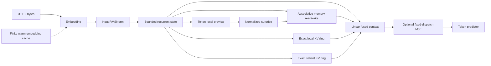

# MapSource - Koemi-3HIP

## Goal

Evoluir a Koemi-3HIP para uma base causal de treino comparavel em ergonomia a
um Transformer pequeno, com memoria hierarquica scanavel, treino instrumentado
e uso heterogeneo de recursos sem desperdicio deliberado.

## Release status

Koemi-3HIP, versao experimental para testes de treino e benchmark.
Nao e a consolidacao final da HERM; os gates de recall, ablacao e comparacao
com baselines ainda precisam ser fechados.

## Active specification

### Scope

- Memoria HERM: estado associativo rapido mais memoria lenta de residuos,
  ambos limitados, normalizados e compativeis com affine scan.
- Surpresa causal real: NLL do byte observado sob a previsao do estado anterior.
- Atencao local exata e refine por erro de reconstrucao, sem segundo forward.
- MoE opcional com despacho deterministico por contexto, com um ou `top-k`
  experts por token (padrao um; experimento T4 usa 128/6).
- Treino com AMP, acumulacao de gradiente, AdamW, warmup/cosine, validacao,
  perplexidade e metricas de throughput.
- JSON, JSONL, Alpaca, ShareGPT e texto UTF-8, com split de validacao estavel.
- DataLoader com workers, prefetch, pinned memory e copias non-blocking quando
  o dispositivo permite.
- Cache SSD opt-in com namespace explicito, TTL, exclusao e limite de tamanho.
- PyTorch GPU-first com fallback CPU e precisao segura por dispositivo.
- Benchmark com denominadores de tokens explicitos e erro padrao por token,
  alem de overfit controlado em duas seeds antes de ablacoes.
- A variancia observada no overfit exige no minimo tres seeds independentes por
  configuracao de ablacao; affine + head e a primeira configuracao de controle.
- Runner de ablacao com controles `affine`, `no_refine`, `no_surprise` e `herm`,
  usando o mesmo corpus, budget e tres seeds por configuracao.
- Banco de experts treinavel com despacho hash deterministico; `expert_top_k=1`
  preserva o caminho legado e valores maiores ativam varios experts por token.
  O top-k atual nao e um gate aprendido e nao reivindica especializacao sem
  medir carga e qualidade.
- Frente 2026-09-13: ledger persistente de estados por prefixo, read associativo
  sem o intermediario `[B,L,d,m]`, partida com confianca limitada, buffer exato
  causal de saliencia, hash MoE independente de posicao e refine fora do default.
- Frente A100: notebook de treino monogpu com corpus ingles de programacao e
  matematica verificada, revisoes de dataset fixadas, materializacao auditavel,
  BF16/TF32 e retomada em dois slots atomicos no Drive.
- Frente de otimizacao experimental: seams opt-in para scan CUDA por operacoes
  PyTorch, buffers de estado, politica de precisao, resumo/indexacao de contexto,
  selecao causal, batching de treino/inferencia, blocos exatos RAM/SSD e enqueue
  assincrono limitado; o caminho default permanece inalterado.

### Out of scope

- Garantir memoria infinita ou ausencia total de esquecimento.
- Provar superioridade sobre GRU, LSTM, Mamba ou Transformers sem medicao.
- Saturar GPU, CPU, RAM e SSD simultaneamente sem necessidade medida.
- Treino distribuido, kernel Triton ou kernel CUDA nativo integrado, tokenizer
  aprendido ou deployment.
- MoE com capacity factor e descarte de token: o dispatch e dropless por decisao,
  porque o limite de capacidade existe para limitar o all-to-all de MoE
  distribuido e este treinador roda em um dispositivo.
- Memoria episodica compartilhada entre usuarios ou armazenamento deliberado de PII.
- Alegar ganho em T4, tensor cores ou FP16 sem execucao em hardware CUDA.
- Mudar `memory_features` para 4 sem ablacao de qualidade saturada em tres seeds.
- Prometer que uma sessao Colab, um compilador ou um dataset remoto nunca falhara.
- Treinar ou executar Terminal-Bench e BigCodeBench: sao avaliacao, nao corpus,
  e os artefatos de terminal podem conter ambientes executaveis nao confiaveis.

### Acceptance criteria

- [x] HERM rapido/lento concorda entre execucao paralela e sequencial em logits,
  estados e gradientes.
- [x] Surpresa mede o erro causal do token atual sem consultar o alvo seguinte.
- [x] Refine lento armazena residuos surpreendentes e mantem estados finitos.
- [x] MoE contextual ativa um ou top-k experts por token valido via hash causal;
  a cobertura e a carga sao expostas nas metricas.
- [x] Treino reporta loss, thinking loss, validation loss, perplexidade, LR,
  optimizer steps, tokens/s e precision.
- [ ] AMP e acumulacao preservam o contrato em CPU e no caminho CUDA disponivel.
- [x] Dataset aceita `.txt`, split estavel e DataLoader configuravel.
- [x] Cache SSD exige namespace, expira por TTL e permite delete/clear isolado.
- [x] CLI, checkpoint, README, arquitetura e benchmark refletem a fase atual.
- [x] Suite completa, smoke train/generate e benchmark executam nesta sessao.
- [x] Cada um dos seis problemas de inferencia tem reproducao deterministica
  anterior a mudanca e teste de regressao posterior.
- [x] O ledger encontra o maior prefixo valido, restaura estado isolado e calcula
  apenas o sufixo; TTL, namespace e limites continuam obrigatorios.
- [x] O caminho paralelo evita estados associativos por token e concorda com o
  oraculo sequencial em logits, estado e gradientes.
- [x] Memoria vazia produz saida nula e a confianca cresce sem amplificar o read.
- [x] O buffer de saliencia e causal, limitado e retem tokens surpreendentes alem
  da janela local sem consultar posicoes futuras.
- [x] O hash MoE independe da posicao absoluta e o default nao executa refine.
- [x] Suite, smoke de geracao e benchmark CPU passam; README registra apenas
  numeros medidos nesta maquina.
- [ ] Notebook A100 rejeita linhas remotas fora do contrato, fixa as revisoes e
  materializa o corpus com manifesto e hash antes do treino longo.
- [ ] Notebook A100 passa os testes internos de recuperacao de checkpoint e a
  preflight CUDA de paralelismo, BF16, VRAM e lote real antes de treinar.
- [x] Dez seams de otimizacao permanecem opt-in, tem contratos delimitados e
  testes locais; nenhum altera o forward default ou promete ganho de GPU.
- [ ] Scan CUDA, AMP, streams, buffers, batching e overlap CPU/GPU passam a
  execucao real em GPU, com equivalencia de forward/backward e perfil
  end-to-end antes de qualquer integracao default.
- [ ] ContextSummary, ContextIndex, ContextPolicy e BulkBlockStore passam
  ablacao de recall/qualidade em no minimo tres seeds, com taxa de falso reuse
  zero para blocos exatos e politica de criptografia SSD decidida.
- [ ] BatchingMode e os schedulers passam integracao real com trainer/generation,
  sem perda de ordem, estado, mascara, deadlines ou isolamento entre requests.

### Assumptions

- `expert_count=0` continua sendo o caminho padrao de menor custo.
- Despacho por contexto melhora a particao do byte isolado, mas nao garante
  especializacao semantica.
- A maquina atual tem PyTorch CPU-only; CUDA sera coberto por contrato e teste
  condicional, nao por medicao local inventada.
- AMP automatico usa FP32 em CPU e BF16/FP16 apenas em hardware compativel.
- SSD serve para cache e checkpoint; pesos ativos permanecem em RAM/VRAM.
- "Corrigir cada um" cobre os itens 1 a 6 do diagnostico de 2026-09-13.
- Checkpoints antigos permanecem carregaveis quando a mudanca nao exige estado
  novo; qualquer quebra inevitavel sera declarada antes do commit.
- O objetivo da frente A100 e um assistente de programacao em ingles com
  raciocinio matematico supervisionado de forma visivel; isso nao e uma alegacao
  de cognicao geral nem uma garantia de qualidade sem medicao CUDA.

## Architecture map

## File tree

- `src/koemi/configuration/` - model and training settings.
- `src/koemi/data/` - JSON validation, adapters, serialization, prompt layer, tokenizer.
- `src/koemi/model/memory.py` - recurrent, rank-one associative, local and salient states.
- `src/koemi/model/scan.py` - affine scan and previous-state operations.
- `src/koemi/model/cache.py` - bounded token, exact mapping and prefix-state caches.
- `src/koemi/model/cuda_scan.py` - CUDA-only affine scan backend seam using
  PyTorch tensor operations; native kernel remains out of scope.
- `src/koemi/model/gpu_memory.py` - reusable fixed-layout CPU/CUDA state buffers.
- `src/koemi/model/gpu_precision.py` - device-safe AMP/TF32 policy and FP32 probes.
- `src/koemi/model/context_summary.py` - bounded multi-rate EMA summary and
  confidence read.
- `src/koemi/model/context_index.py` - exact namespace-aware prefix index.
- `src/koemi/model/context_policy.py` - bounded causal surprise/recency/novelty
  admission policy.
- `src/koemi/model/experts.py` - stacked expert bank, hash and learned dispatch.
- `src/koemi/model/network.py` - Koemi-3HIP forward paths.
- `src/koemi/training/dataset.py` - causal chunks and thinking masks.
- `src/koemi/training/objective.py` - causal and thinking-weighted loss.
- `src/koemi/training/trainer.py` - optimizer, metrics and logs.
- `src/koemi/training/batching_mode.py` - length-aware microbatch plan and
  gradient-accumulation boundaries.
- `src/koemi/training/a100_run.py` - pinned corpus, A100 preflight, calibration,
  BF16 loop, metrics and rotating Drive checkpoints.
- `src/koemi/training/checkpoints.py` - weights-only checkpoint contract.
- `src/koemi/training/generation.py` - longest-prefix resume and stateful generation.
- `src/koemi/runtime/inference_batching.py` - compatible request queues, padded
  batches, deadlines and result handles.
- `src/koemi/runtime/bulk_blocks.py` - exact fixed-token RAM/SSD block store.
- `src/koemi/runtime/bulk_executor.py` - bounded CPU preparation and optional CUDA
  stream/event enqueue.
- `src/koemi/observability/report.py` - self-validating standard run report.
- `src/koemi/observability/resources.py` - peak memory probe per device.
- `benchmarks/run_benchmark.py` - three-model harness emitting the standard report.
- `benchmarks/run_ablation.py` - multi-seed ablation aggregating standard reports.
- `tests/` - data, model, cache, training and checkpoint contracts.

## Reference map

- `src/koemi/model/network.py` - recurrent scan, surprise write, fusion and head.
- `src/koemi/model/memory.py` - bounded state, rank-one chunk read and exact rings.
- `src/koemi/model/experts.py` - `ExpertBank`, `ExpertRouter`,
  `RouterStatistics`, `merge_router_statistics` e `ExpertMixture.combine`.
- `src/koemi/model/cache.py` - finite cache ownership, prefix hash chain and instrumentation.
- `src/koemi/model/cuda_scan.py` - CUDA affine scan contract and synchronized
  diagnostic boundary; this is not a native custom kernel.
- `src/koemi/model/gpu_memory.py` and `src/koemi/model/gpu_precision.py` -
  reusable state storage, device precision selection and FP32 comparison probes.
- `src/koemi/model/context_summary.py`, `context_index.py` and `context_policy.py`
  - bounded lossy summary, exact prefix identity and causal admission policy.
- `src/koemi/training/batching_mode.py` - deterministic length bucketing and
  padded-token accounting without materializing samples.
- `src/koemi/runtime/inference_batching.py`, `bulk_blocks.py` and
  `bulk_executor.py` - request batching, exact RAM/SSD blocks and bounded async
  preparation/enqueue seams; none executes the model implicitly.
- `src/koemi/training/dataset.py` - `thinking_mask` propagation.
- `src/koemi/training/objective.py` - weighted token cross entropy.
- `src/koemi/training/a100_run.py` - source adapters, corpus manifest, batch
  sampler, CUDA preflight, checkpoint payload and overnight session contract.
- `notebooks/Koemi-3HIP_A100.ipynb` - self-contained Colab setup, embedded
  runner, internal tests and nine-hour A100 invocation.
- `docs/A100_CODE_REASONING_TRAINING.md` - research-backed corpus and runtime
  decisions, licenses, exclusions and limitations.

## Decisions

> [!warning] Reverted history
> `D-008` through `D-014`, `D-019`, `D-020` and `KOEMI-010` through `KOEMI-014`
> describe work that was reverted out of the tree on 2026-09-13. `git log` carries eleven reverts
> covering the standard run report, the grouped expert dispatch, the learned
> router, the WikiText-2 harness, the dataset directory support and the seed split.
> Their measurements remain true statements about experiments that ran; their code
> is not in the repository. Some of those ids are duplicated because two sessions
> numbered in parallel. Do not cite them as current state, and do not reuse an id
> below `D-021` or `KOEMI-019`.

### D-001 - Remove learned routing

The 2026-09-11 benchmark sent 0.10% of `bytes` and 1.56% of `recall` tokens to
the deep path, with no measurable loss gain. The router, deep path, routing
loss and balance loss are removed rather than preserved as inactive complexity.

### D-002 - MoE is fixed dispatch in Koemi-3HIP

Learned MoE gating is a router under another name. Koemi-3HIP dispatches one expert
with `token_id % expert_count`. The trade-off is lower semantic adaptivity; the
benefits are predictable compute, one active expert and no routing collapse.

### D-003 - Surprise modulates memory writes, never execution paths

The model computes a token-local preview from the recurrent state before the
memory read. Its normalized entropy scales the associative write weight. This
preserves causal scanability and avoids using the unknown target token.

### D-004 - Cache has a RAM token tier and an opt-in SSD mapping tier

Automatic prompt-state reuse can mix sessions and retain private data. Koemi-3HIP
stores detached embeddings keyed by token id, with bounded capacity and explicit
clear/statistics operations. An optional disk mapping cache stores validated
logits and recurrent state for an exact hashed sequence, with atomic writes and
a capacity limit. Carried recurrent state remains caller-owned.

### D-005 - Thinking is a supervised target contract

The serializer marks thinking bytes separately. The training objective exposes a
`thinking_loss_weight`; weight 1 preserves the ordinary causal loss, while a
different value changes emphasis without claiming that text supervision is an
internal reasoning process.

### D-006 - Preserve the scan oracle

The parallel affine scan remains compared with the sequential path. Any future
GPU optimization must retain this equivalence test before a kernel or compiler
change is accepted.

### D-007 - Keep cache limits and hot paths explicit

The SSD cache enforces the serialized file-size limit and evicts only entries
from its own checkpoint namespace. The local-memory empty check stays in tensor
operations instead of synchronizing the host on every sequential GPU token.

### D-008 - One run report schema for every model

Priority 1 of the 2026-09-12 optimization brief. `src/koemi/observability/report.py`
owns a self-validating `RunReport`. The same keys are emitted for `koemi`, `gru`
and `lstm`; the ablation is a field, never a different shape. Loss is always in
nats and `validation_bpb` is derived as `nats / ln(2)`, so a report cannot
disagree with itself. Throughput is emitted twice, including and excluding the
validation time contained in `elapsed_seconds`, because `benchmarks/run_benchmark.py`
evaluates outside the timed window while `koemi train` evaluates inside it.
`train_tokens_per_second` keeps the old definition (tokens over elapsed) so
historical numbers stay comparable. Rejected alternative: one throughput field
with a redefined meaning, which would silently invalidate every number already
recorded in `docs/BENCHMARK.md`.

`parameters_receiving_gradient` was added to satisfy the brief's rule that an
ablation must be proven to skip work. Parameter count alone cannot prove it,
because `KoemiModel` allocates every module for every ablation.

### D-009 - Separate data and initialization seeds

`--seed` controls model initialization and stochastic training. `--data-seed`
controls synthetic record generation, validation split and loader shuffle, with
default `0`. This keeps multi-seed quality comparisons on one corpus instead of
mixing initialization variance with data variance.

### D-010 - Benchmark runtime selection

`run_benchmark.py` and `run_ablation.py` accept `--device` and `--precision`.
`auto` resolves to CUDA when available and to CPU otherwise; the report records
the resolved device and precision. Baselines use the same device, autocast and
FP16 gradient scaler contract as Koemi. The local host cannot produce CUDA
measurements because its PyTorch wheel is CPU-only.

### D-011 - CPU/GPU hot-path optimization scope

The HERM projection groups now preserve the old affine math with concatenated
outputs, and local-memory sequence joins use preallocated copy buffers. The
benchmark exposes `--compile` with dynamic shapes, but the local Windows host
cannot compile the model because Inductor reports that MSVC `cl` is missing;
the smoke also reports a graph break in input validation. No compile speedup is
claimed.

### D-019 - The expert bank keeps two dispatch modes

> [!warning] This decision describes code reverted out of the tree on 2026-09-13.

The 2026-09-12 request was to make MoE training real inside HERM. Hash dispatch
cannot specialise: the expert that holds byte `a` holds it in every context, so
each expert learns an arbitrary slice of the distribution rather than a function.
A learned gate is what makes an expert bank a mixture of experts.

D-002 rejected a router. The reason it gave, unpredictable compute and routing
collapse, applied to the depth router removed in D-001, which sent a fraction of
tokens down a deeper path. A width router placed after the fused context is a
per-token function and never touches the affine scan, so scanability is not the
constraint at stake; collapse is, and it is handled by the auxiliary balance term
plus optional gate jitter.

Both modes stay. `expert_routing = "hash"` remains the default so every number
already recorded stays reproducible and so the cheapest path has no gate that can
collapse. `expert_routing = "learned"` is opt-in, with `expert_top_k`,
`expert_load_balance_weight` and `expert_router_jitter`. Rejected alternative:
replacing hash dispatch outright, which would have invalidated the existing
ablation history for no measured quality gain.

Dispatch is dropless in both modes. A capacity factor exists to bound the
all-to-all of distributed MoE; on one device it only drops tokens and costs
quality.

### D-020 - Expert weights are stacked, not a module list

> [!warning] This decision describes code reverted out of the tree on 2026-09-13.

`nn.ModuleList` of per-expert `nn.Linear` forces one Python-level call per expert
and cannot be batched. `ExpertBank` holds one stacked tensor per projection and
exposes per-expert views through `unbind`, so each parameter enters the autograd
graph once. An earlier version indexed the stacked parameter directly with
`weight[expert_index]`; that created one `select` node per expert, each allocating
a gradient buffer the size of the whole bank, and measured slower than the loop it
replaced. The measurement is in `docs/BENCHMARK.md`.

### D-012 - Aggregate learned-router statistics globally

The auxiliary balance term is defined from the product of dispatch fraction and
gate importance over all valid tokens. `RouterStatistics` carries probability
mass, expert occupancy and valid count out of each window, and the network merges
those tensors before calculating `router_loss`. Rejected alternative: averaging
the scalar window losses, which made the result depend on `scan_chunk` and caused
parallel and sequential execution to disagree.

### D-013 - Use a static batched pair dispatch

`ExpertMixture.combine` now sends every token-expert pair through batched `bmm`
operations and masks invalid pairs after the expert computation. The static
shape removes the dynamic occupancy conversion, host synchronization and
per-expert Python loop from the hot path while keeping dispatch dropless. The
trade-off is padded work and temporary gathered weights proportional to the
number of token-expert pairs; CUDA memory and launch behavior remain unverified.

### D-014 - Evaluate thinking through answer bytes

The `perf/thinking-training` branch treats visible thinking as supervised text,
not evidence of internal reasoning. It keeps the existing relative trace
weight, but logs answer loss and answer BPB independently so a lower trace loss
cannot be presented as a better answer. Chunks without a supervised target are
discarded because they have no gradient and no state reaches another chunk.

Rejected alternative: using aggregate causal loss as the quality claim for
thinking. It mixes trace and answer bytes and cannot answer whether reasoning
supervision helped the response.

### D-015 - Offload ranks parameters by measured arithmetic per byte

The 2026-09-13 request was a real offload across accelerator, host memory and
storage. The discriminator is not parameter size, it is FLOPs per parameter byte,
which for this architecture equals how many token-rows reach the module. One
calibration forward records those rows with pre-forward hooks, the module type
turns them into FLOPs, and the budget is filled from the highest ratio down.

Measured on the 16-wide model with four experts: `token_predictor` is entered
twice per forward, once for the logits and once for the surprise preview, so it
ranks first; the memory and fusion projections see every token; each expert sees
only its dispatched share; `embedding` performs a gather and reports zero FLOPs,
so it ranks last. Rejected alternative: a hand-written table of module names,
which would be a guess and would lie the moment an ablation or expert count
changed.

Three tiers. `accelerator` keeps the parameter resident. `host` keeps the
parameter as the autograd leaf in host memory and lends a compute-device copy
around each forward, so gradients reach the leaf and the optimizer is untouched.
`disk` evicts the parameter and reads it back per forward, and refuses a
parameter that still requires a gradient: a weight the optimizer updates cannot be
discarded after every forward. That restriction also names the case the tier is
for, a finetune over a frozen base, and inference.

### D-016 - Offload attaches through hooks, not through the trainer

The engine registers forward hooks on the owning modules. `Trainer` has no
knowledge of offload, `KoemiModel.forward` is unchanged, and the checkpoint
contract is unchanged. The CLI owns the lifecycle: calibrate on the first batch,
attach, run, log, detach. Rejected alternative: threading a placement argument
through `Trainer` and `KoemiModel`, which would couple a memory policy to the
model contract.

The borrow lends a view when the compute device already holds the parameter, so the
mechanism runs identically with or without an accelerator instead of collapsing to a
no-op that `nn.Module.__setattr__` silently undoes.

### D-017 - The inference prompt is the serialized training prefix

The 2026-09-13 request was a first-class layer for a system prompt plus an ordinary
user prompt, so internal prompts become usable and user prompts stop needing
workarounds. The correctness property is one equality, and it is the whole design:
the prefix built at inference must be byte-identical to the prefix the serializer
wrote during training, up to the first supervised position. `build_answer_prompt`
and `build_thinking_prompt` live in `data/serialization.py` next to the markers
they must mirror, and `supervised_prefix_bytes` makes the equality directly
testable.

`system_text` is context and never a target. Its bytes carry `supervised=False`, so
the model conditions on the instruction and is never trained to emit it.

`system_text` is the last field of `DatasetRecord` with a `None` default, so every
positional construction in the adapters, the readers, the benchmarks and the tests
keeps working. A record without a system prompt serializes to exactly the bytes it
did before the field existed; a test pins that, because the Colab run in flight
uses that format.

Rejected alternative: adding the field in semantic position, first, which would
have broken every positional `DatasetRecord(...)` call site for a cosmetic gain.

### D-018 - Structured prompting is the default at inference

`koemi generate` now wraps `--prompt` in the role markers by default and prints
only the continuation. The old behaviour sent the raw string, which is a prefix the
model never saw when the dataset had outputs, so the default was wrong rather than
merely inconvenient. `--raw-prompt` keeps the verbatim path for a checkpoint trained
on plain text and is refused together with `--system`. Stripping the prefix raises
when the generated text does not start with it, instead of silently returning the
whole string.

This is a behaviour change to a command, declared in the commit and in the README.

### D-021 - The span markers are reserved at the record contract

A byte vocabulary of 256 content ids plus one padding id leaves no room for
dedicated control tokens, so the role markers are ordinary UTF-8 and any text
containing one could move a span boundary. The tags therefore live in
`data/contracts.py` and `DatasetRecord.__post_init__` rejects them, which places
the guard where every ingestion path already passes: the canonical, Alpaca and
ShareGPT adapters and the plain-text reader all build records through the same
constructor. The prompt builders carry the same check, because a prompt is a prefix
the model reads exactly as it read training bytes.

Rejected alternative: validating inside `serialize_record`, which runs per chunk
during training and would fail a run in progress instead of failing at load.
`--raw-prompt` stays permissive on purpose, for a checkpoint never trained with
markers.

### D-023 - Keep associative writes rank one through the chunk

The parallel path no longer expands each write into `[B,L,d,m]` or asks the
affine scan to retain one matrix per token. `MemoryWriteTerms` carries decay,
value, feature and weight factors. `scan_and_read` forms the causal `[B,C,C]`
write/query influence matrix and contracts it with values; it returns only the
reads and the final `[B,d,m]` state. The sequential path remains the oracle.

The startup gate is deliberately applied after the epsilon-regularized read:
`confidence = den / (den + epsilon)`. This makes an inconsistent state with
zero evidence produce zero instead of amplifying its basis by 256. It is a
behavior change, not an algebraic restatement of the previous normalization.

`ablation=no_refine` becomes the model default because refine consumed 53% of
the old forward for 0.002 bpb across three seeds. Full HERM remains explicit
through `ablation=herm`. The rank-one chunk evaluator reverses the old chunk
trade-off: a fresh 4 x 256 CPU sweep measured median 5,576, 9,267, 14,568,
18,150 and 13,626 tok/s at chunks 16, 32, 64, 128 and 256. The default therefore
stays 128. `memory_features` stays 16 pending a saturated three-seed quality
ablation.

### D-022 - Expert dispatch is content only, through a mixing hash

A 64-expert run on 14,865 validation tokens reported occupancy between 200 and 269
with chi-square per degree of freedom of 0.924 on 63 degrees of freedom, minimum at
-2.13 sigma and maximum at +2.43 sigma. That is indistinguishable from a uniform
random partition. Byte frequency is heavily skewed, so a dispatch carrying content
information cannot produce uniform occupancy; perfect balance was proof that the
dispatch carried none.

The cause was `positions * POSITION_HASH_FACTOR` in the hash. It re-randomises the
assignment of the same bigram at every position, so no expert can accumulate a
coherent token set and specialisation is impossible by construction rather than by
lack of training. Reproduced on 26,036 independent bytes: chi-square per degree of
freedom 1.10 at 64 experts with the position term, 102.15 without it.

Dropping the term exposed a second defect. The hash was affine, and
`remainder(expert_count)` reads only the low bits: `1000003 mod 64 = 3` and
`97409 mod 64 = 1`, so the bucket was `(3 * byte + previous) mod 64`. With
consecutive bytes that collapses to `(4 * byte - 1) mod 64`, reaching 16 buckets of
64, and 1 of 4 at four experts. A 32-bit xor-shift-multiply finalizer reaches 63 of
64 and 4 of 4.

Mixing does not uniformly improve occupancy, and that is expected: at 8 experts it
moves chi-square per degree of freedom from 216.83 to 40.86, at 64 experts from
102.15 to 161.08. The higher value is the true skew of byte-bigram frequency rather
than an accident of an affine map. Distinct bigrams per expert stay at 10 to 29
either way with no empty expert, and grouped dispatch keeps total work constant, so
the skew costs throughput nothing.

Rejected alternative: hashing the current byte alone, which left 4 of 64 experts
idle and one expert holding 15.60% of tokens on the same corpus.

BREAKING: an expert bank trained under the position hash was trained on a different
partition, so the checkpoint format goes from 5 to 6 and those files are refused.

### D-024 - Cache fixed-width prefix state instead of full prompt output

`DiskMappingCache` now keeps prefix-state entries alongside exact whole-output
entries. A rolling BLAKE2 chain produces every prefix key in O(L), so lookup walks
from the longest candidate without hashing every slice again. Each entry stores
only the final logits and bounded `KoemiState`; prompt evaluation resumes from the
longest hit and writes another snapshot at each `scan_chunk` boundary and at the
end. Namespace, sliding TTL, per-entry size and shared capacity still apply.

Rejected alternative: storing all prefix logits. It grows with prefix length and
throws away the fixed-width advantage. The final logits are necessary because a
post-write state alone cannot reconstruct the prediction emitted for its last
token.

### D-025 - Salience is a second causal exact buffer

The local key/value projections feed a second bounded ring. A token is admitted
when its causal surprise exceeds `salience_threshold`; vectorized reads expose
only carried entries and admitted positions strictly before the query. The ring
keeps the last `salience_memory_size` admitted entries, independent of distance,
and enters fusion through its own projection slice.

The reversible defaults are 16 entries and threshold 0.75. They define a testable
mechanism, not a quality claim; the threshold and capacity require a saturated
detail-recall ablation. Reusing local projections avoids another parameter bank.
Rejected alternative: top-k by surprise over the whole window, which consults
future tokens and is not causal.

Adding the fourth fusion input changes learned weight dimensions, so checkpoint
format 7 refuses formats 5 and 6 instead of partially loading incompatible
weights.

### D-026 - Optimization seams remain opt-in until end-to-end proof

The CUDA, buffer, precision, context and batching modules are separate contracts
and do not alter `KoemiModel` or `Trainer` by import alone. A seam can enter the
default path only after forward/backward equivalence, quality checks and a
measured end-to-end win include its staging, padding, launch and synchronization
costs. This keeps a plausible microbenchmark from becoming a regression in the
real training loop.

### D-027 - Bulk blocks are exact, bounded and namespace-scoped

`BulkBlockStore` accepts fixed token blocks, carries a digest chain and requires
full sequence validation before releasing a payload. RAM and SSD capacities,
TTL, namespace identity and explicit serialization are mandatory. It never
interprets similar prompts as equivalent, and its local SSD payloads are not
encrypted until key ownership and a protection policy are defined.

### D-028 - CPU/GPU overlap is dependency-driven

`BulkExecutor` exposes bounded CPU preparation and optional CUDA stream/event
enqueue. It does not promise “extreme async” or overlap SSD, host and device for
every workload. Pinned host memory, non-blocking copies and explicit stream
dependencies must be measured on the target GPU; a thread pool alone is not a
GPU optimization.

### D-029 - The current CUDA scan is a backend seam, not a native kernel

`cuda_affine_scan` uses PyTorch tensor operations on CUDA and retains the
sequential chunk-carry contract. No `.cu`, Triton or compiled extension was
delivered because this host has no CUDA runtime to execute or profile it. A
native fused implementation is a later replacement behind this boundary only
if the target profile proves the launch/allocation overhead is material.

### D-030 - Field audit gates optimization by measured bottleneck

The 2026-09-16 field audit separates verified source facts from performance
hypotheses. The first implementation order is: profile a real CUDA target;
remove host synchronizations and avoidable allocations; stabilize expert,
window and batch shapes; replace the causal `C^2` materialization only when
the profile confirms it; then implement a fused CUDA operator with CPU
fallback, forward/backward equivalence and `opcheck`. Titans, MIRAS, RNNs and
SSMs are comparison and ablation families, not drop-in optimizations for the
existing HERM memory.

Rejected alternative: writing a native kernel or a device driver before a
CUDA profile. A driver is the wrong layer, and a blind kernel can increase
build, numerical and maintenance risk without improving end-to-end training.

## Work fronts

- [x] Koemi-1FPA research prototype, historical.
- [x] Koemi-3HIP implementation.
- [x] Koemi-3HIP verification and documentation.
- [ ] Koemi-3HIP CPU/GPU benchmark with sufficient recall budget.
- [x] HERM memory and contextual MoE, branch `main`, active.
- [x] Full training pipeline and private SSD cache, branch `main`, queued.
- [x] KOEMI-010 separate data and initialization seeds.
- [x] Tarefa 4 benchmark device and precision flags with CPU smoke verification.
- [x] Tarefa 5 projection fusion, local-memory buffers and compile flag; GPU/compile performance pending.
- [x] Tarefa 6 WikiText-2 harness with official splits and article grouping; external download run pending.
- [x] Thinking training metrics and no-gradient chunk filtering, branch
  `perf/thinking-training`, isolated from concurrent `main` work; commit
  `4b4e548`.
- [x] Correcao dos seis gargalos HERM de 2026-09-13, branch `main`; implementada
  e verificada localmente, com qualidade CUDA e saliencia ainda sem ablacao.
- [x] Notebook A100 code-and-reasoning, branch `main`; especificacao em
  `docs/A100_CODE_REASONING_TRAINING.md`, runner, notebook e testes locais
  implementados; preflight CUDA e corpus remoto continuam pendentes.
- [x] Frente de otimizacao HERM, 2026-09-16: tres seams GPU/CUDA, tres seams
  de contexto e quatro seams Batching/Bulk implementados de forma opt-in, com
  contratos e testes locais; nenhum foi integrado ao caminho default.
- [ ] Frente de otimizacao HERM: executar CUDA real, medir forward/backward,
  streams, VRAM, padding, fila, hit-rate e throughput end-to-end em hardware
  alvo antes de promover qualquer seam.

## Suspicion zone

### KOEMI-001 #risk/high

- Severity: high
- Status: open
- Location: `src/koemi/model/memory.py:88`
- Condition: two bounded associative tiers may not express strongly interacting
  key/value associations over long contexts.
- Impact: recall can remain below GRU, Mamba or attention despite stable scans.
- Evidence: at 1,024 training records and four epochs, HERM reached 4.817 bpb
  versus 5.033 bpb for affine, but refine and surprise did not improve it.
- Proposed fix: run MQAR and exact key/value recall before increasing state width.

### KOEMI-002 #risk/medium

- Severity: medium
- Status: open
- Location: `src/koemi/model/experts.py:9`
- Condition: token-hash dispatch may group unrelated bytes and prevent useful
  expert specialization.
- Impact: MoE adds parameters and memory without improving quality.
- Evidence: measured 2026-09-13. Under the old position hash the dispatch was a
  uniform random partition, chi-square per degree of freedom 0.924 on a real
  64-expert run, so specialisation was impossible by construction. D-022 removed
  the position term and the assignment now carries information, 161.08 at 64
  experts. Whether that converts into quality is still unmeasured.
- Proposed fix: compare expert_count 0, 2 and 4 at equal total parameter budget.

### KOEMI-003 #risk/medium

- Severity: medium
- Status: mitigated
- Location: `src/koemi/model/cache.py:35`
- Condition: cached embeddings become stale after model embedding weights change.
- Impact: using a cache during training can silently optimize stale vectors.
- Evidence: cache entries are detached by design.
- Proposed fix: implemented model-training rejection and regression test.

### KOEMI-004 #risk/medium

- Severity: medium
- Status: open
- Location: `src/koemi/training/dataset.py:24`
- Condition: a thinking loss weight above one can overfit visible reasoning text.
- Impact: token prediction may improve on traces without improving answers.
- Evidence: no answer-vs-thinking ablation exists.
- Proposed fix: report both losses and add an answer-only evaluation split.

### KOEMI-005 #risk/low

- Severity: low
- Status: open
- Location: `benchmarks/run_benchmark.py:1`
- Condition: the new HERM result is still a one-run, small-budget smoke test.
- Impact: quoting them as Koemi-3HIP evidence would be false.
- Evidence: 16 train records, 8 evaluation records and one epoch; no full
  Transformer parity or MQAR result exists. Overfit loss varied from 0.190 to
  0.366 across two seeds.
- Proposed fix: keep the result diagnostic, require at least three seeds per
  ablation and expand the benchmark protocol.

### KOEMI-006 #risk/high

- Severity: high
- Status: mitigated
- Location: `src/koemi/model/cache.py:245`
- Condition: disk mappings and prefix-ledger snapshots contain model state that
  can encode prompt content, even though filenames store only hashes.
- Impact: an opt-in SSD cache can retain sensitive information beyond a request.
- Evidence: both cache payloads include recurrent state and logits by design.
- Proposed fix: namespace, sliding TTL, isolated delete/clear and size limits
  are implemented; payload encryption and production tenant authorization are
  still external responsibilities.

### KOEMI-007 #risk/medium

- Severity: medium
- Status: open
- Location: `src/koemi/training/trainer.py:146`
- Condition: CUDA AMP, pinned transfer and GPU throughput cannot be executed on
  the current CPU-only environment.
- Impact: GPU-first performance and numerical behavior remain unverified.
- Evidence: the CUDA contract test was skipped because CUDA is unavailable.
- Proposed fix: run the same suite and benchmark on a CUDA host before claiming
  GPU speedup or precision stability.

### KOEMI-010 #risk/medium

- Severity: medium
- Status: open
- Location: `benchmarks/run_benchmark.py`, line reference belongs to a reverted revision
- Condition: `--seed` drives both the synthetic data generator and the weight
  initialization, so a multi-seed sweep changes the corpus and the initialization
  at the same time.
- Impact: on the `bytes` task the supervised token count changes per seed, which
  confounds initialization variance with corpus variance and makes a multi-seed
  mean ill-defined. `aggregate_run_reports` now refuses such a merge instead of
  blending it.
- Evidence: `recall` answers are always three characters, so its token counts stay
  equal across seeds and the existing recall ablations aggregate cleanly. The
  `bytes` task does not have that property.
- Proposed fix: split `--data-seed` from `--seed` so the corpus is held fixed and
  only the initialization varies.

### KOEMI-011 #risk/medium

- Severity: medium
- Status: open
- Location: `src/koemi/model/experts.py`, line reference belongs to a reverted revision
- Condition: dynamic occupancy sizing in `combine` forced a device-to-host
  synchronization and a Python loop over experts.
- Impact: CUDA dispatch could stall once per scan window and break graph capture.
- Evidence: `combine` now uses static pair indices, batched `bmm` and a tensor
  mask; source audit found no `.tolist()`, `torch.nonzero` or `torch.argsort` in
  the dispatch path. The full suite passes on the CPU-only host.
- Proposed fix: closed for the synchronization cause; profile temporary memory
  and launch time on a CUDA host before claiming a speedup.
- Reopened 2026-09-13: the mitigation was reverted with the grouped expert dispatch.

### KOEMI-012 #risk/low

- Severity: low
- Status: open
- Location: `src/koemi/model/network.py`, line reference belongs to a reverted revision
- Condition: the auxiliary balance term was reduced independently in each scan
  window.
- Impact: `router_loss` depended on `scan_chunk` and execution mode.
- Evidence: `RouterStatistics` is merged before `load_balance`; the new
  `test_parallel_and_sequential_router_loss_use_the_same_global_statistics`
  passes after reproducing `1.083452940` versus `1.179314971` before the fix.
- Proposed fix: closed by global statistics aggregation.
- Reopened 2026-09-13: the mitigation was reverted with the learned router.

### KOEMI-013 #risk/medium

- Severity: medium
- Status: open
- Location: `src/koemi/model/experts.py`, line reference belongs to a reverted revision
- Condition: learned routing trains and balances, but no measured quality result
  compares it against hash dispatch at an equal parameter budget.
- Impact: quoting learned routing as better would be unsupported.
- Evidence: see the probe recorded under Verification status; at that budget the
  configurations sit inside the seed spread.
- Proposed fix: run the comparison at a saturated budget on a CUDA host, three
  seeds, equal parameters, with the standard run report.

### KOEMI-014 #risk/medium

- Severity: medium
- Status: open
- Location: `src/koemi/model/experts.py`, line reference belongs to a reverted revision
- Condition: static pair dispatch gathers one expert weight slice per token-expert
  pair before each batched matrix multiplication.
- Impact: temporary memory grows with batch size, sequence length, top-k, width
  and hidden width; long windows can erase the launch reduction or cause OOM.
- Evidence: correctness is covered by the expert reference tests. A small CPU
  probe at width 32 and 128 tokens measured batched/legacy ratios of `1.851x`
  for 2 experts, `1.034x` for 8 and `0.287x` for 32; CUDA is absent and the
  larger 1,024-token probe exceeded the executor window.
- Proposed fix: measure a T4 profile and compare projection-wise gathering with a
  capacity-padded bank layout before increasing the default window or top-k.

### KOEMI-015 #risk/medium

- Severity: medium
- Status: open
- Location: `src/koemi/training/trainer.py:121`
- Condition: the trainer validates once per epoch inside the timed loop and then
  runs one more full validation pass after the loop to build the result.
- Impact: a run with a validation loader pays N+1 validation passes for N epochs,
  and the in-loop passes inflate `elapsed_seconds`.
- Evidence: `tests/test_cli.py::test_train_writes_the_standard_run_report` shows
  `train_tokens_per_second_excluding_validation` above the including variant on
  the CLI path, while the benchmark path reports `0.0` validation seconds.
- Proposed fix: reuse the last epoch's validation metrics instead of recomputing
  them. One change, one commit, measured before and after.
- Reopened 2026-09-13: a fix landed in commit `7b8c025` and was reverted, so the
  condition is present in the tree again.

### KOEMI-016 #risk/low

- Severity: low
- Status: open
- Location: `src/koemi/model/experts.py:19`
- Condition: the zero-expert path could allocate `output_normalizer` without
  using it.
- Impact: dead parameters would enter checkpoints and parameter-matched
  comparisons.
- Evidence: `expert_bank` and `output_normalizer` are registered as `None` when
  `expert_count=0`; `test_zero_experts_have_no_dead_normalizer_parameters` passes.
- Proposed fix: closed by the zero-expert module registration in `684604c`.
- Reopened 2026-09-13: a fix landed in commit `91b540e` and was reverted, so the
  condition is present in the tree again. The residency measurement re-detected it as
  a 128-byte gap between the plan and the cache at `embedding_size=32`.

### KOEMI-017 #risk/high

- Severity: high
- Status: open
- Location: `src/koemi/runtime/offload.py:1`
- Condition: the 2026-09-13 request also asked for Triton or CUDA kernels, grouped
  GEMM, a fused HERM scan, fused routing, GPU token compaction, CUDA Graphs, FP8
  and NCCL-overlapped expert parallelism across GPUs.
- Impact: none of it can be compiled, run or measured on this host, which is
  `torch 2.14.0+cpu` with `torch.cuda.is_available()` false. Writing it blind would
  produce code that looks finished and fails inside a long run on the real device.
- Evidence: the reverted history of this repository already contains one case where
  an intermediate expert-dispatch version measured 0.17x against the loop it
  replaced, and only a forward-plus-backward measurement exposed it.
- Proposed fix: a CUDA host. Until then the seam is the place to build: a dispatch
  boundary with a measured PyTorch fallback, so a kernel drops in without touching
  the model.

### KOEMI-019 #risk/medium

- Severity: medium
- Status: open
- Location: `src/koemi/configuration/settings.py:19`
- Condition: the salient ring defaults to 16 entries with threshold 0.75, but
  neither value has a saturated trained quality ablation.
- Impact: the mechanism is causal and bounded, but its default may spend exact
  context compute without improving fine-detail recall.
- Evidence: causality, bounded state and execution equivalence pass; the current
  CPU sweep measures its cost but does not establish a quality gain.
- Proposed fix: compare capacity and threshold at an equal saturated budget over
  three seeds on a detail-recall task before claiming benefit or retuning defaults.

### KOEMI-021 #risk/high

- Severity: high
- Status: open
- Location: `src/koemi/training/a100_run.py`, `notebooks/Koemi-3HIP_A100.ipynb`
- Condition: a long A100 run can consume credits while a remote schema, dataset
  revision, Drive write, dynamic batch shape or CUDA path is unverified.
- Impact: an invalid corpus, unrecoverable checkpoint or unsupported execution
  path could waste a material part of the bounded Colab budget.
- Evidence: the local host is CPU-only; the A100 notebook and runner are
  statically checked and their mocked contracts pass, but the real data/Drive/
  A100 path has never completed in this environment.
- Proposed fix: source-specific mocked tests, immutable source revisions,
  atomic two-slot checkpoints, an A100 preflight and a measured batch calibration
  before the long loop. Keep `torch.compile` disabled until it proves equivalent
  and faster on this exact workload.

### KOEMI-022 #risk/high

- Severity: high
- Status: closed
- Location: `src/koemi/training/a100_run.py:596-660`, `notebooks/Koemi-3HIP_A100.ipynb`
- Condition: Hugging Face source streams can repeat an upstream identifier, causing
  corpus construction to abort after downloading data with `selected corpus contains
  duplicate record identifiers`.
- Impact: a Colab session spent on Hub downloads stopped before training and could
  waste the user's bounded compute budget.
- Evidence: the user's A100 notebook run reproduced the failure; the local duplicate
  stream regression test now passes.
- Proposed fix: reject duplicate identifiers while collecting each source, count the
  rejection in the source report, and continue scanning until the quota is filled;
  the embedded notebook runner is synchronized with the module.

### KOEMI-023 #risk/high

- Severity: high
- Status: open
- Location: `src/koemi/model/cuda_scan.py:45`, `gpu_memory.py:45`,
  `gpu_precision.py:97`, `src/koemi/runtime/bulk_executor.py:96`
- Condition: the new CUDA, AMP, stream and event paths have contract tests but
  this environment has no CUDA runtime or device.
- Impact: numerical equivalence, kernel launch cost, allocator behavior, stream
  ordering and actual CPU/GPU overlap remain unknown; a regression could appear
  only during a paid A100/T4 run.
- Evidence: local PyTorch is `2.14.0+cpu`, `torch.cuda.is_available()` is false,
  and the CUDA tests are conditional skips.
- Proposed fix: run the full CUDA contract on the target GPU, compare FP32 and
  AMP forward/backward against the sequential oracle, and capture tokens/s,
  p50/p95 latency, peak VRAM and transfer bytes before integration.

### KOEMI-024 #risk/medium

- Severity: medium
- Status: open
- Location: `src/koemi/model/context_summary.py:175-207`, `:297-334`
- Condition: empty-read detection and state/value validation use
  `.detach().cpu().item()` on the current implementation.
- Impact: an opt-in GPU summary update or read can force host scalar
  synchronization and erase the latency benefit of a short memory path.
- Evidence: source audit on 2026-09-16; the default HERM path does not construct
  `ContextSummary`.
- Proposed fix: keep serialization and diagnostics at the host boundary, then
  replace hot-path scalar checks with a supported asynchronous/device-side
  validation strategy and measure the resulting error behavior on CUDA.

### KOEMI-025 #risk/medium

- Severity: medium
- Status: open
- Location: `src/koemi/model/context_index.py:32-44`
- Condition: tensor sequences passed to the CPU exact-prefix index are detached,
  copied to CPU and converted to Python lists.
- Impact: passing GPU token IDs to the index can introduce a device-to-host copy
  and synchronization before a lookup, making a cache check more expensive than
  the suffix it intends to skip.
- Evidence: source audit on 2026-09-16; the index is intentionally CPU-side and
  only CPU tensor execution was tested.
- Proposed fix: require CPU sequences at this boundary or hash on the caller's
  device and pass a validated digest, then compare end-to-end lookup cost.

### KOEMI-026 #risk/medium

- Severity: medium
- Status: open
- Location: `src/koemi/model/context_policy.py:195-465`, `:634-635`
- Condition: admission loops over candidates and fixed capacity and uses the
  private `torch._assert_async` API for finite-input checks.
- Impact: large candidate/capacity settings can create launch and memory costs,
  while a PyTorch compatibility change can break the validation path.
- Evidence: CPU tests cover causal, bounded and deterministic behavior; no CUDA
  profile or supported-API compatibility matrix exists.
- Proposed fix: keep capacity bounded, profile the real candidate distribution,
  replace private APIs only after a supported device-side assertion is selected,
  and retain a CPU regression for each failure contract.

### KOEMI-027 #risk/high

- Severity: high
- Status: open
- Location: `src/koemi/runtime/bulk_blocks.py:308-313`
- Condition: exact BulkMode blocks can persist prompt-derived state on SSD with
  integrity checks but without encryption.
- Impact: local disk access can expose user prompts, recurrent state or logits;
  a digest detects corruption but does not provide confidentiality.
- Evidence: the module documents the limitation and its SSD tests use explicit
  temporary directories; no key-management or encrypted-at-rest contract exists.
- Proposed fix: choose a key owner and authenticated encryption format before
  enabling persistent prompt-derived blocks; until then keep the tier opt-in and
  private, with retention and deletion tests.

### KOEMI-028 #risk/medium

- Severity: medium
- Status: open
- Location: `src/koemi/runtime/inference_batching.py:315-387`,
  `bulk_executor.py:339-369`
- Condition: batching and bulk seams expose caller-owned completion, cancellation
  and stream waits rather than owning model execution and lifecycle shutdown.
- Impact: an integration can leak active batches, return late state, deadlock on
  backpressure or close a stream before a consumer reads it.
- Evidence: isolated lifecycle tests pass, but no integration test connects the
  scheduler, HERM forward, state cache and shutdown path.
- Proposed fix: add an integration harness with cancellation, deadline,
  exception, backpressure, stream dependency and graceful-close cases before
  connecting these seams to generation or training.

### KOEMI-029 #risk/high

- Severity: high
- Status: open
- Location: `src/koemi/model/memory.py:97-144`
- Condition: causal associative reads materialize pairwise influence with a
  `[B,C,C]` structure inside each chunk.
- Impact: work and temporary memory can grow approximately with
  `B*C^2*(d+memory_features)`, limiting chunk size and dominating prefill.
- Evidence: convergent read-only audit by three independent fronts on
  2026-09-16; no CUDA profile has measured its share of end-to-end time.
- Proposed fix: benchmark the current path against a tiled/microblock path
  that carries only the state between blocks, then require causal and gradient
  equivalence before replacing the implementation.

### KOEMI-030 #risk/high

- Severity: high
- Status: open
- Location: `src/koemi/model/scan.py:17-32`, `src/koemi/model/cuda_scan.py:169-213`
- Condition: affine scan uses Python-controlled stages, concatenations and
  temporary tensors; the CUDA seam is still composed of PyTorch operations,
  not a native `.cu` or compiled operator.
- Impact: repeated launches and allocations may erase GPU parallelism, while
  the CPU-only host prevents confirming the actual cost or numerical behavior
  on NVIDIA hardware.
- Evidence: source audit and local runtime `torch 2.14.0+cpu` with
  `torch.cuda.is_available() == false` on 2026-09-16.
- Proposed fix: preserve the current scan as oracle, profile it on the target,
  then add a fused operator with CPU fallback, backward coverage and
  forward/state/gradient equivalence tests.

### KOEMI-031 #risk/medium

- Severity: medium
- Status: open
- Location: `src/koemi/model/experts.py:45-73`
- Condition: expert dispatch still relies on Python iteration, `nonzero`,
  indexed selection and accumulation, despite the static batched dispatch
  intent recorded in `D-013`.
- Impact: dynamic dispatch can cause graph breaks, irregular memory traffic and
  poor GPU utilization; the decision and implementation may have drifted.
- Evidence: source audit on 2026-09-16; no CUDA profiler or end-to-end dispatch
  comparison was run in this audit.
- Proposed fix: revalidate `D-013` against the current code, implement one
  batched candidate only behind equivalence tests, and keep it opt-in until
  forward-plus-backward timing proves a win.

### KOEMI-032 #risk/medium

- Severity: medium
- Status: open
- Location: `src/koemi/runtime/inference_batching.py:467-518`,
  `src/koemi/runtime/batching_mode.py:123-139`
- Condition: the scheduler limits raw token totals while emitted batches are
  padded to the longest request, and the batching plan is not integrated into
  the trainer or model execution path.
- Impact: `max_batch_tokens` can understate actual work and memory, while the
  advertised BatchingMode/BulkMode seams currently add no measured throughput
  or latency benefit by themselves.
- Evidence: source audit on 2026-09-16; only isolated contract tests exist and
  no integrated CUDA execution was measured.
- Proposed fix: enforce a padded-token budget, add length buckets and an
  integration harness for queue, cancellation, state ownership and shutdown;
  accept only measured p50/p95 and throughput improvement.

## Resolved suspicions

### KOEMI-008 #risk/medium

- Severity: medium
- Status: closed
- Location: `src/koemi/runtime/offload.py:421`
- Condition: the host tier casts with `parameter.to(compute_device)`, which returns
  the parameter itself when the device already matches.
- Impact: on a CPU-only host the tier is a no-op, so the host-to-device transfer
  and its overlap with compute are unverified. `host_transferred_bytes` counts the
  bytes that would move, not bytes that moved.
- Evidence: measured `host_materializations=29` per forward with
  `host_transferred_bytes` equal to the parameter footprint, on a host where
  `torch.cuda.is_available()` is false.
- Proposed fix: measure on a CUDA host, then add a copy stream and prefetch of the
  next module while the current one computes.
- Closed 2026-09-13 by commit `8b1d445`: `lend_to_device` returns a view when the
  compute device already holds the parameter, so the borrow produces a distinct plain
  tensor on every device and the swap is exercised on a CPU-only host. The counter
  became `host_borrows`, and `host_transferred_bytes` now counts only bytes that
  crossed devices, measured as 0 here. The physical copy and its overlap with compute
  stay unverified under KOEMI-017.

### KOEMI-009 #risk/low

- Severity: low
- Status: closed
- Location: `src/koemi/runtime/offload.py:296`
- Condition: the disk tier reads a parameter from storage on every forward with no
  residency cache, so a module used once per scan window is read once per window.
- Impact: measured 329 reads and 1,311,532 bytes for six generated bytes over a
  211,888-byte model, 1.39 s inside the reads. That is 6.2 times the parameter
  footprint.
- Evidence: `offload_plan disk_materializations=329 disk_read_bytes=1311532
  disk_read_seconds=1.3927` from `koemi generate`.
- Proposed fix: a bounded residency cache keyed by module with a least-recently-used
  eviction, sized by a third budget. The correctness contract does not change,
  only the read count.
- Closed 2026-09-13 by commit `88616d6`: `DiskParameterStore` holds a bounded
  least-recently-used read cache sized by `--offload-residency-mib`, off by default.
  Generating 24 bytes from a 111,024-byte model went from 925 reads, 3,778,900 bytes
  and 2.1926 s to 110,896 bytes and 0.2017 s with 892 hits: 34.1 times fewer bytes
  and 10.9 times less time in reads, with logits still bit-exact.

### KOEMI-018 #risk/low

- Severity: low
- Status: closed
- Location: `src/koemi/data/contracts.py:18`
- Condition: the role markers are plain UTF-8 byte sequences, not reserved
  vocabulary, so a dataset whose text contains `<|system|>` or `<|output|>` can
  forge a span boundary.
- Impact: a crafted record could place supervised-looking text where the trainer
  expects context, or make an inference prompt appear to end earlier than it does.
- Evidence: the byte vocabulary has 256 content ids plus one padding id, with no
  room for dedicated control tokens.
- Proposed fix: reject a record whose text contains a marker, or reserve control
  ids once a learned tokenizer exists. Rejecting is cheap and belongs in the
  adapters.
- Closed 2026-09-13 by commit `738b36d`: the tags live in `data/contracts.py` and
  `DatasetRecord.__post_init__` rejects any span carrying one, so every ingestion path
  passes the same guard; the prompt builders reject them in the system and user text.
  A forged record and a forged `--prompt` both exit 2 naming the field and the tag.

## Root causes

### KOEMI-ROOT-001 - Windows terminal encoding

- CLI output previously failed on replacement characters because the default
  Windows stream was not UTF-8. Completion now writes encoded bytes.

### KOEMI-ROOT-002 - Padding written to local memory

- Padded rows previously became zero key/value entries without a validity mask.
  Koemi-3HIP carries explicit local validity alongside the ring.

### KOEMI-ROOT-003 - Windows peak working set

- Benchmark memory counters required explicit ctypes signatures; the historical
  harness contains that fix.

### KOEMI-ROOT-004 - Window-local router balance reduction

- The network averaged already-computed window products instead of combining
  router probability mass and occupancy first. `RouterStatistics` now preserves
  those additive components and calculates one global balance term per forward.
- Regression test: `tests/model/test_moe_contract.py`, commit `8b7675e`.

### KOEMI-ROOT-005 - Dynamic expert occupancy dispatch

- `combine` converted occupancy to a Python list and iterated over experts. The
  static pair batch now clamps invalid indices, applies batched projections and
  masks invalid pairs without a dynamic host-side shape.
- Regression coverage: `tests/model/test_experts.py` grouped-dispatch and
  invalid-window cases, commit `8b7675e`.

### KOEMI-ROOT-006 - Thinking metrics used the wrong denominator

- On `perf/thinking-training`, the accumulator multiplied each batch thinking
  loss by every supervised token, including answer tokens. Reported trace loss
  therefore depended on batch composition rather than thinking-token loss.
  The branch uses category counts, exposes answer loss/BPB and keeps detached
  metric scalars on-device until the epoch boundary.
- Regression coverage: `tests/training/test_thinking_contract.py`.

### KOEMI-ROOT-007 - Associative scan expanded every rank-one write

- Symptom: `memory_features=64` reduced throughput to 0.21x and the parallel
  path materialized `[B,L,d,m]` increments plus scanned states.
- Cause: `MemoryWriteTerms` expanded the outer product before scanning and
  `forward_window` retained every matrix state to read it one position later.
- Fix: keep `(weight, value, feature)` factors and contract causal write/query
  influence through `[B,C,C]`, returning only the final matrix state.
- Regression test: `tests/model/test_associative_read.py` and all-parameter
  gradient equivalence in `tests/model/test_execution.py`.
- Location: `src/koemi/model/memory.py:97`; commit `081269e`.

### KOEMI-ROOT-008 - Epsilon read trusted an inconsistent empty normalizer

- Symptom: a nonzero basis with denominator zero produced amplitude 256.
- Cause: the read divided by `denominator + 2^-8` without gating on evidence.
- Fix: multiply the regularized read by `denominator / (denominator + epsilon)`.
- Regression test: `test_zero_evidence_suppresses_an_inconsistent_basis`.
- Location: `src/koemi/model/memory.py:150`; commit `081269e`.

### KOEMI-ROOT-009 - Position destroyed stable expert identity

- Symptom: the same bigram reached different experts at different positions.
- Cause: absolute position entered the deterministic dispatch hash; the remaining
  affine low bits also collapsed power-of-two expert banks.
- Fix: hash only current/previous byte and apply a 32-bit mixing finalizer.
- Regression test: `tests/model/test_dispatch.py`.
- Location: `src/koemi/model/experts.py:28`; commit `391ad94`.

## Project commands

- `.koemi-venv/Scripts/python.exe -m unittest discover -s tests -v`
- `.koemi-venv/Scripts/python.exe -m koemi inspect-dataset --dataset examples/canonical.jsonl`
- `.koemi-venv/Scripts/python.exe -m koemi train --dataset examples/canonical.jsonl --checkpoint artifacts/koemi-3hip.pt --overwrite`
- `.koemi-venv/Scripts/python.exe -m koemi generate --checkpoint artifacts/koemi-3hip.pt --prompt "FIFO means"`
- `.koemi-venv/Scripts/python.exe benchmarks/run_benchmark.py --task bytes --report artifacts/bench-bytes-schema.json`
- `.koemi-venv/Scripts/python.exe benchmarks/run_ablation.py --task recall --seeds 17 29 41 --report artifacts/ablation-recall-schema.json`
- `.koemi-venv/Scripts/python.exe -m unittest discover -s tests -p 'test*.py'`
- `.koemi-venv/Scripts/python.exe -m compileall -q src benchmarks tests`
- `koemi train --report PATH --validation-fraction 0.1` writes the standard schema.

## Glossary

- `HIP`: HERM Initial Phase, the current Koemi-3 research line.
- `thinking`: optional supervised target span, separate from internal state updates.
- `surprise`: token-local uncertainty proxy used to scale associative writes.
- `fixed-dispatch MoE`: expert bank selected by deterministic token hash, no router.
- `warm cache`: bounded embedding cache reused by an explicit inference caller.
- `scan oracle`: sequential execution used to verify the parallel affine scan.
- `BatchingMode`: deterministic length-aware microbatch planning without sample copies.
- `BulkMode`: bounded exact block storage plus asynchronous preparation/enqueue seams.
- `GPU-first`: keep tensor work on the accelerator when measured, with explicit
  CPU staging and dependency ordering rather than implicit copies.
- `prefix block`: fixed token sequence and bounded state identified by an exact
  namespace-scoped digest; it is not a semantic match.

## Verification status

- 2026-09-13: `origin` was repointed to `Koemi-3HIP`; no push was performed by
  this session.

- Historical Koemi-1FPA tests and benchmarks were verified on 2026-09-11.
- Koemi-3HIP implementation and documentation were completed on 2026-09-13.
- `.koemi-venv\\Scripts\\python.exe -m unittest discover -s tests -v`: 45 tests,
  OK, 1 CUDA test skipped because the host is CPU-only.
- Smoke: train with validation/accumulation and generate with namespaced SSD
  mapping cache, both exit 0.
- Recall smoke: 5.235 eval nats, 7.552 bits/byte, 356.9 eval tokens/s, 102.6
  train tokens/s, 27,756 parameters and 4,304 state bytes/sequence.
- `.koemi-venv\\Scripts\\python.exe -m compileall -q src benchmarks tests`: PASS.
- `inspect-dataset`: 3 canonical records validated.
- `train`: checkpoint saved with thinking loss and fixed-expert metrics.
- `generate`: RAM cache metrics emitted; the same prompt produced an exact SSD
  mapping-cache hit on the second request.
- Tiny legacy pre-HIP bytes benchmark: train 5.3805 nats, eval 4.8398 nats, 3131.32
  eval tokens/s on CPU; this is a smoke test, not a quality or hardware claim.
- Sufficient CPU/GPU recall benchmark remains pending; historical numbers are
  not evidence for Koemi-3HIP.

### 2026-09-12 - standard run report (brief priority 1)

- `.koemi-venv\Scripts\python.exe -m unittest discover -s tests`: 73 tests, OK,
  1 CUDA test skipped. 24 of those tests are new.
- `benchmarks/run_benchmark.py --task bytes` and `--task recall`, three models
  each, exit 0. Artifacts: `artifacts/bench-bytes-schema.json`,
  `artifacts/bench-recall-schema.json`.
- Measured on `bytes` (48 train records, 16 evaluation records, two epochs,
  sequence 96, batch 8, CPU, fp32): koemi 3.7489 bpb at 606.1 train tokens/s,
  gru 3.7981 bpb at 1560.8 tokens/s, lstm 4.0353 bpb at 5134.1 tokens/s. Single
  seed, 1,031 validation tokens. Not a quality claim.
- The benchmark harness reports `validation_seconds_inside_elapsed = 0.0` for
  every model, so its throughput comparison was never contaminated by validation
  time. The `koemi train` path is the one that measures validation inside
  `elapsed_seconds`. See KOEMI-015.
- No WikiText-2 harness exists in this repository or in its git history
  (`git log --all -S wikitext` is empty). The 3.145 bpb / 92,300 tokens/s / T4 /
  FP16 numbers quoted in the 2026-09-12 brief were produced outside this
  repository and cannot be reproduced or audited here. This host is
  `torch 2.14.0+cpu`, `torch.cuda.is_available() == False`, four threads.
- `benchmarks/run_ablation.py --task recall --seeds 17 29 41 --train-records 256
  --evaluation-records 512 --epochs 2`, exit 0. Artifact:
  `artifacts/ablation-recall-schema.json`. Aggregation verified end to end:
  identical 1,536 validation tokens and 16 optimizer steps across seeds, mean
  and standard deviation emitted inside the standard schema.
- Parameters without a gradient per ablation: affine 8,907, no_refine 161,
  no_surprise 32, herm 32. `no_surprise` owns no parameter of its own, so only
  throughput can detect it. Refine is the expensive half: 1.58x against 1.07x.
- That ablation ran at two epochs, below the saturation point recorded for
  recall, so it is a schema verification and not a capacity measurement.

### 2026-09-12 - dataset source expansion (Tarefa 7)

- Loader now expands a directory into sorted UTF-8 `.txt` documents and accepts
  local `.parquet` and `.arrow` files through the optional `datasets` package.
- Named Hugging Face datasets use `--dataset-name`, `--dataset-config`,
  `--dataset-split` and `--text-field`; rows with missing, non-string or empty
  text fields fail explicitly.
- CLI requires exactly one of local `--dataset` paths or `--dataset-name`.
- The optional dependency is declared as `koemi[datasets]`; it was not
  installed on the current CPU host, so a real remote/tabular load was not
  measured here.

### 2026-09-12 - trainable expert bank

- `.koemi-venv\Scripts\python.exe -m unittest discover -s tests`: 112 tests, OK,
  1 CUDA test skipped. 25 of those cover the expert bank and the router.
- `compileall -q src tests`: PASS.
- Grouped dispatch measured against the previous loop, paired A/B in one process,
  4,096 tokens at width 64, forward plus backward: 0.97x at two experts, 1.33x at
  eight, 1.66x at thirty-two, 1.95x at sixty-four. Table in `docs/BENCHMARK.md`.
- `koemi train --expert-count 8 --expert-routing learned --expert-top-k 2
  --expert-load-balance-weight 0.01 --expert-router-jitter 0.05`: exit 0, loss
  5.861 to 5.697 over two epochs, `router_loss` 1.3457 to 1.3293. Checkpoint saved
  and reloaded with the router restored and the settings round-tripped.
- Three-seed routing probe, eight experts, 96 training records, three epochs:
  hash 1.4478 +/- 0.1923 bpb, learned top-2 balanced with jitter 1.9533 +/- 0.1255.
  Hash wins by 0.505 bpb against a 0.459 threshold of twice the combined
  deviation. The balance term moved the auxiliary value from 1.4121 to 1.0653 and
  the busiest expert from 50.6% to 13.9% against a 12.5% uniform floor.
- Reading: the mixture is functional and the balancer is verified; learned routing
  is not a demonstrated quality gain at this budget, so hash stays the default.
  See KOEMI-013.
- `parameters_receiving_gradient` equalled `parameters` in every probe
  configuration, so no configuration carries an unused tensor.

### 2026-09-12 - MoE dispatch and global balance follow-up

- Regression reproduced before the change: with learned top-2 routing and
  `scan_chunk=3`, parallel `router_loss=1.083452940` and sequential
  `router_loss=1.179314971`; logits differed by at most `3.6e-7`.
- After the change, `tests.model.test_moe_contract`, `tests.model.test_experts`
  and `tests.model.test_execution` passed with 32 tests; the full suite passed
  with 114 tests and one CUDA skip.
- The static pair path was source-audited for dynamic `.tolist()`, `nonzero` and
  `argsort` calls. A small CPU probe measured batched/legacy ratios of `1.851x`,
  `1.034x` and `0.287x` for 2, 8 and 32 experts respectively, with maximum
  absolute output error `4.768e-7`; this is diagnostic only, not a T4 claim.
- Learned CLI smoke passed: one epoch, learned top-2, jitter and balance weight;
  checkpoint/reload and generation exited 0. The report exposed total FLOPs
  `107472` and active FLOPs `88080` for that model; `report.py` changes from the
  parallel agent were left untouched.

### 2026-09-12 - thinking training and answer BPB branch

- Isolated worktree: `C:\Users\Brenno\Desktop\Koemi-thinking-training`, branch
  `perf/thinking-training`, created because `main` was changing concurrently.
- Before the change, a long prompt retained 23 chunks including chunks with no
  supervised target, and a two-epoch run with validation called `evaluate` three
  times. The branch filters no-gradient chunks and reuses the final epoch's
  validation result.
- `tests.training.test_thinking_contract`, affected training/data contracts and
  the full current suite pass on CPU. CUDA synchronization behavior is not
  locally measurable because the installed PyTorch build is CPU-only.
- CLI smoke with canonical records and `thinking_loss_weight=2.0` logged
  `thinking_loss=5.536009`, `answer_loss=5.523928` and
  `answer_bpb=7.969343`; it is a functional smoke, not a quality comparison.

### 2026-09-12 - Colab MoE thinking runbook

- Added `notebooks/colab_moe_thinking_t4.ipynb` in the isolated
  `perf/thinking-training` worktree. It clones the published training branch,
  mounts Drive, validates GPU memory, counts exact total/active parameters on
  the meta device, streams and filters `open-r1/OpenR1-Math-220k` into the
  canonical Koemi JSONL contract, trains with a hard three-hour budget and
  8-bit AdamW, saves a Drive checkpoint, reports thinking/answer BPB and
  generates a sample.
- The notebook was JSON-parsed and all eight code cells compiled locally.
  Runtime execution was not available because this host has no PyTorch CUDA
  environment; T4 memory, bitsandbytes and remote dataset loading remain
  Colab acceptance checks.
- The runbook deliberately documents that the byte-level model and math-only
  corpus do not establish general language quality or genuine reasoning after
  one short run. The optimizer checkpoint is weights-only; optimizer resume is
  outside this runbook.
- Follow-up correction: the first notebook log divided accumulated microbatch
  losses by optimizer steps but omitted `gradient_accumulation_steps` (16).
  Commit `d170eeb` fixes the denominator. Historical logs from that run must be
  divided by 16: step 80 was about `1.13` answer BPB and `2.27` objective loss.
- The follow-up runbook revision is commit `63dad81`: it uses a distinct
  `koemi-moe-thinking-3h30-v2.pt` Drive checkpoint, a 3h20 effective budget
  inside the requested 3h30 window, optional weights-only resume, repetition
  penalty plus no-repeat n-gram sampling, and UTF-8-safe decoding. These
  generation controls affect inference only; they do not add a training loss.
- Commit `12ab588` adds Colab observability: a HERM/MoE architecture diagram,
  a wall-clock progress bar with percent and remaining time updated each
  optimizer step, and live epoch-estimate plots for loss, answer BPB and
  throughput. Notebook JSON and all code cells compile locally; rendering and
  live CUDA execution remain Colab-only checks.

### 2026-09-13 - parameter offload

- Every commit from the 2026-09-12 session was reverted before this one; `git log`
  shows eleven reverts. The report schema, the grouped expert dispatch and the
  learned router are not in the tree. The Colab run producing
  `koemi-moe-thinking-3h30-v2.pt` executes code that is not in this repository.
- `.koemi-venv\Scripts\python.exe -m unittest discover -s tests`: 80 tests, OK,
  1 CUDA test skipped. 31 of those are new: 24 for the offload engine, 7 for the
  command line.
- `compileall -q src tests benchmarks`: PASS.
- Bit-exact equivalence verified with `torch.equal`, not `allclose`: logits and
  every parameter gradient match a fully resident model under host-tier offload,
  and logits match under full disk-tier offload with frozen weights.
- `koemi train --offload-accelerator-mib 0 --offload-host-mib 1` on the canonical
  dataset: exit 0, 29 modules and 211,888 bytes on the host tier, checkpoint saved.
- `koemi generate --offload-accelerator-mib 0 --offload-host-mib 0 --offload-store`:
  exit 0, 54 parameter files written, 329 disk materializations, 1,311,532 bytes
  read, 1.3927 s inside the reads for six generated bytes.
- Reading: the mechanism and the policy are verified. The value of the host tier on
  real hardware is not, because the copy is the identity when the compute device is
  the host. See KOEMI-015.
- Still open from the same request and not started: quantization, speed profiles,
  the system-prompt layer, and everything requiring CUDA (KOEMI-017).

### 2026-09-13 - system and user prompt layer

- `.koemi-venv\Scripts\python.exe -m unittest discover -s tests`: 103 tests, OK,
  1 CUDA test skipped. 23 of those are new for the prompt layer and the command.
- Byte compatibility pinned: a record without `system` serializes to
  `<|input|>\nExplain FIFO.\n<|output|>\nFIFO means first in.`, identical to the
  format the Colab run in flight is training on.
- Prefix invariant verified for both targets and for multibyte text:
  `supervised_prefix_bytes(record) == build_answer_prompt(system, user).encode()`.
- `inspect-dataset` and `train` on a record carrying `system`, `thinking` and
  `output`: exit 0, 128 total bytes with 45 supervised, so the system span is
  excluded from supervision as intended.
- `generate` verified in three modes: answer target, thinking target and
  `--raw-prompt`. The first two print only the continuation; the third echoes the
  prompt as before.
- A ShareGPT `system` turn was previously rejected as an unsupported role. It now
  becomes the system span, and a record with only a system turn plus an assistant
  answer is accepted.
- Still open from the 2026-09-13 request and not started: quantization, speed
  profiles, and everything requiring CUDA (KOEMI-017).

### 2026-09-13 - closing the offload and marker risks

- `.koemi-venv\Scripts\python.exe -m unittest discover -s tests`: 125 tests, OK,
  1 CUDA test skipped.
- `compileall -q src tests benchmarks`: PASS.
- KOEMI-015, KOEMI-016 and KOEMI-018 closed; see Resolved suspicions for the
  numbers and the commits.
- The residency measurement re-detected a 128-byte gap between the plan and the
  cache at `embedding_size=32` with `expert_count=0`: the expert output normalizer
  is allocated and never entered, so it is never read. That is the dead-parameter
  finding from the reverted KOEMI-009, still present in the tree.
- MapSource ids are unique again. The duplicated `D-009` and `D-010` from the
  parallel session became `D-019` and `D-020`, each marked as reverted code, and the
  suspicion zone is sorted by id.

### 2026-09-13 - content-only expert dispatch

- `.koemi-venv\Scripts\python.exe -m unittest discover -s tests`: 134 tests, OK,
  1 CUDA test skipped. 9 of those are new for the dispatch.
- `compileall -q src tests benchmarks`: PASS.
- The external 3h20 T4 run that motivated this predates every commit in this
  session, so its losses describe old code and are not evidence about the tree.
  Two of its findings survive because they are version independent: the dispatch
  uniformity above, and an arithmetic error in its own metric.
- That harness reports `answer_bpb` roughly 3.47 times too low. Its validation dict
  is self-consistent, `1.651490569114685 / ln 2 = 2.3825972541`, while the training
  tail averages 0.6872 over the last twelve logged steps. The ratio 3.467 implies an
  answer share of 0.2884 of supervised tokens, which is what dividing the answer
  negative log likelihood by the total supervised count instead of the answer count
  produces. The confirming signature is variance: coefficient of variation 0.028 for
  the loss against 0.166 for `answer_bpb`, six times noisier, because the divisor
  changes with every batch. The real answer figure is 2.38 bits per byte, not 0.63.
  That harness is not in this repository and the fix belongs there.
- Implemented dispatch verified against a standalone probe on the same 26,036 bytes:
  identical chi-square per degree of freedom of 40.86, 108.47 and 161.08 at 8, 16
  and 64 experts.

### 2026-09-13 - rank-one read, prefix ledger and salience ring

- Reproductions before the change: shared prefix `0 hits/2 misses`; rank-one
  write expanded to `(1,5,8,4)`; zero denominator produced amplitude 256;
  salience state absent; default `herm` allocated its refine gate.
- `.koemi-venv\Scripts\python.exe -m compileall -q src benchmarks tests`: PASS.
- `.koemi-venv\Scripts\python.exe -m unittest discover -s tests -v`: 147 tests,
  OK, one CUDA test skipped because the host is CPU-only.
- Parallel/sequential logits, every carried state and every parameter gradient
  agree in both `no_refine` and `herm` within the existing numerical tolerance.
- CPU FP32 forward, batch 4 x 256, d=64, m=16, local/salient=16, chunk=128:
  median 18,196 tok/s over seven timed runs. Full refine: 15,850 tok/s.
- Chunk sweep 16/32/64/128/256: 5,576 / 9,267 / 14,568 / 18,150 /
  13,626 tok/s. The old 32 default proposal was rejected after the new evaluator
  changed the optimum; 128 remains default.
- `memory_features` 4/64 measured 17,726 / 15,328 tok/s. The old dominant
  sensitivity disappeared after removing `[B,L,d,m]` from the runtime path.
- A 1,024-token prefix plus 16-token suffix reused exactly 1,024 tokens,
  processed 16, matched full-forward logits with maximum error 0 and reduced
  median latency 2.39x including SSD load.
- CLI smoke trained and loaded checkpoint format 7; the second raw-prompt
  generation reused four prefix tokens and logged `prefix_hits=1`.
- CUDA/FP16 performance and salience quality remain unverified on this host.

### 2026-09-13 - Koemi-3HIP documentation and visual explainers

- The public name is now `Koemi-3HIP` (Koemi-3 HERM Initial Phase). The Python
  package/import remains `koemi` for API stability; package metadata is 0.3.0.
- README, architecture notes, benchmark labels, CLI descriptions and checkpoint
  examples use the new name. Legacy training curves are explicitly labeled
  pre-HIP historical evidence.
- Added four English, enterprise-style diagrams under `assets/`: ecosystem
  overview, HERM hierarchy/equations, runtime/prefix reuse, and limits/tests.
  They use a white canvas, black text and a monochrome pastel-yellow palette.
- Added `notebooks/Koemi-3HIP_Analysis.ipynb` with English evaluation output,
  explicit answer/thinking denominators, moving-median curves and runtime plots.
- Notebook JSON parses successfully; full test and compile gates remain required
  after any notebook execution or documentation change.

### 2026-09-13 - T4 overnight MoE experiment

- Added `notebooks/Koemi-3HIP_T4_Overnight.ipynb`, an English Colab harness for
  `HuggingFaceTB/smol-smoltalk` (English conversational instruction data,
  Apache-2.0; source: https://huggingface.co/datasets/HuggingFaceTB/smol-smoltalk).
- The harness configures `expert_count=128`, `expert_top_k=6`, FP16 autocast on
  CUDA, pinned/prefetched batches, a five-hour wall-clock budget, resumable
  checkpoints, JSONL step logs, validation BPB/perplexity, throughput, GPU
  memory, surprise statistics and expert-load entropy/Gini plots.
- No CUDA result is claimed here: the notebook must be executed on a T4. The
  deterministic top-k router is an explicit baseline, not learned semantic MoE.

- Local verification after this block: `.koemi-venv\\Scripts\\python.exe -m
  unittest discover -s tests` passed 149 tests with one CUDA skip; compileall
  passed and the notebook JSON plus every non-magic code cell compiled.
- Follow-up fix `71ad078`: the Colab setup now runs `pip install -e .` so the
  `src/koemi` package is importable before notebook cells execute.
- Follow-up fix `0ee5317`: imports now prepend `/content/Koemi-3HIP/src`
  directly to `sys.path`; the notebook no longer depends on editable-install
  resolution in Colab.

### 2026-09-13 - complete T4 notebook rewrite from repository contracts

- Replaced `notebooks/Koemi-3HIP_T4_Overnight.ipynb` instead of extending the
  previous runbook. The new cells follow the current `DatasetRecord`, marker,
  `CausalByteDataset`, `TrainingObjective`, `KoemiState`, cache and parallel /
  sequential execution contracts.
- The setup clones the repository, prepends `/content/Koemi-3HIP/src` before
  importing `koemi`, installs only the notebook-side `datasets`, `pandas` and
  `matplotlib` dependencies, and mounts Drive for resumable results.
- The runbook now audits rejected remote rows instead of dropping them silently,
  keeps the record-level seed split, uses the documented `scan_chunk=128` default,
  probes a real FP16 forward/backward batch size, mirrors gradient accumulation
  and warmup/cosine scheduling, and writes model/optimizer/scaler checkpoints.
- It reports causal/task/answer/thinking losses with independent denominators,
  token-level standard errors, p50/p95 CUDA timings, state norms and bytes,
  non-finite gradients, memory peaks, deterministic top-k load entropy/Gini,
  parallel-vs-sequential equivalence, zero-evidence confidence, exact prefix
  reuse, warm-token cache statistics, generation output, a CLI-compatible
  `CheckpointStore` model checkpoint and a final zip archive.
- During the rewrite, a public README sentence that had been accidentally
  concatenated to the MoE section was restored; no benchmark claim changed.
- Static verification after the rewrite: notebook JSON parsed, all nine code
  cells compiled, `compileall` passed, and the full suite passed 149 tests with
  one CUDA skip. Actual CUDA/Drive/dataset execution remains a Colab-only gate.

### 2026-09-13 - A100 budget assessment for the overnight notebook

- Local `HEAD` and `origin/main` were both `94ab988145889279599ae12299b31a508847cbbd`;
  the assessment is for the published Koemi-3HIP notebook, not a stale local copy.
- The current `d=128`, `128 experts`, `top_k=6` configuration has 12,914,835
  trainable parameters. Direct counts at widths 64, 128 and 256 verified the
  no-refine parameter formula `779d^2 + 1183d + 275`; a 384-wide run would be
  115,322,771 parameters and activates 7,150,739 parameters per byte position.
- The user reported 200 Colab compute units at about 6.77 units per A100 hour,
  which is 29.54 A100 hours while that rate remains unchanged. This corrects the
  earlier mistaken six-hour budget. Colab Pro does not guarantee one continuous
  29-hour VM, so the notebook must resume from Drive checkpoints across bounded
  sessions.
- A nominal 1B configuration is `d=1132` (999,568,727 parameters), but it still
  activates 60,875,839 parameters per byte and creates at least an 11.17 GiB
  model-plus-Adam checkpoint before activations and CUDA allocator overhead.
  Thirty A100 hours can run this configuration, but cannot establish a useful
  1B from-scratch language model on this corpus without throughput and data-scale
  evidence.
- Recommendation for the first long CUDA run: use `d=512` (0.205B total), split
  the approximately 28-hour training budget into resumable sessions, and reserve
  the remaining balance for validation, report export and generation. Promote to
  `d=768` only when emitted supervised-tokens/s and peak-memory measurements show
  adequate data coverage and runtime cost.
- No A100 runtime has been executed locally. The new notebook is A100-oriented
  and its logged `supervised_tokens_per_second` plus peak VRAM must be used to
  size any second run; the older five-hour notebook remains T4-oriented.

## Suspicion zone

- **KOEMI-020** — `src/koemi/model/experts.py:59-73` — condition: the six
  assignments are generated by fixed hash offsets and averaged, without a
  learned balancing loss; impact: experts may receive uneven semantic or byte
  traffic even when aggregate counts look acceptable; severity: medium; action:
  report entropy, min/max and Gini in the overnight notebook before claiming
  quality or specialization.

### 2026-09-14 - A100 code-and-reasoning notebook

- Added `src/koemi/training/a100_run.py` and embedded the same source in
  `notebooks/Koemi-3HIP_A100.ipynb`. The runner pins four Hub revisions, filters
  verified code/math rows, excludes Terminal-Bench and BigCodeBench, materializes
  a SHA-256 corpus, and uses the repository's causal byte/thinking contracts.
- The default model is `embedding_size=512`, `128 experts`, `top_k=6`,
  `scan_chunk=128`, `ablation=no_refine`: 204,816,147 parameters. The notebook
  enables BF16/TF32, calibrates a real A100 batch, trains for exactly nine hours,
  writes JSONL metrics, and rotates two atomic Drive checkpoints every 15 minutes.
- Added source-adapter, filtered-chunk, sampler-resume, checkpoint-recovery,
  full-payload and notebook-compile tests. The local command
  `.koemi-venv\\Scripts\\python.exe -m unittest discover -s tests -p 'test*.py'`
  passed 158 tests with one expected CUDA skip. `compileall`, `git diff --check`,
  notebook cell compilation and exact embedded-source parity also pass.
- Acceptance remains open for the actual Colab A100 preflight, remote streaming
  downloads and nine-hour CUDA session; this CPU-only host cannot claim those
  results. The notebook stops before training if any of those checks fail.

### 2026-09-14 - Hub duplicate-ID recovery

- A real Colab run reached corpus selection but failed on a repeated upstream
  identifier. Source collection now skips duplicates deterministically and records
  the count; Hugging Face 429 loads also retry with bounded exponential backoff.
- Added a regression test for duplicate source identifiers and synchronized the
  embedded A100 runner. Targeted tests and notebook parity pass locally; the remote
  Hub retry and full A100 run remain unverified on this CPU-only host.

### 2026-09-16 - HERM optimization lab

- Spawned three GPU/CUDA fronts, waited for all three, then spawned three context
  fronts; after those six completed, spawned four Batching/Bulk fronts. Their
  write sets are isolated under `src/koemi/model/`, `src/koemi/training/` and
  `src/koemi/runtime/`, with matching tests.
- Added opt-in contracts for a PyTorch CUDA affine-scan backend, reusable state
  buffers, device precision/FP32 comparison, multi-rate context summaries,
  exact prefix indexing, causal context admission, length-aware training plans,
  compatible inference queues, exact RAM/SSD blocks and bounded async enqueue.
- `.koemi-venv\Scripts\python.exe -m compileall -q src benchmarks tests`: PASS.
  The focused six-seam suite passed 63 tests with 11 conditional CUDA skips.
  The complete suite passed 271 tests with 13 conditional CUDA skips.
- The local runtime is Python 3.13.14 with `torch 2.14.0+cpu` and
  `torch.cuda.is_available() == false`; no A100/T4 execution, CUDA timing,
  native `.cu` kernel, end-to-end batching gain, context recall ablation or
  quality improvement is claimed.
- The default `KoemiModel`/`Trainer` path was not changed. The exact block store
  uses explicit JSON/bytes and integrity checks, but its SSD payloads are not
  encrypted; GPU validation, host-sync removal in context summary/index paths,
  and integration lifecycle remain open under KOEMI-023 through KOEMI-028.

### 2026-09-16 - GPU, memory and runtime field audit

- Three read-only subagents independently audited the repository and returned
  convergent findings. No source file, test or runtime contract was changed by
  this audit; all agents were closed after their reports were reviewed.
- The shared priority is P0 host-sync and allocation removal; P1 static-shape
  windows, batched expert dispatch, tiled associative reads and a fused scan;
  P2 integrated length buckets, pinned H2D, stream/event overlap and exact
  prefix/block reuse. Every optimization remains a hypothesis until measured
  end to end on CUDA.
- Titans is a neural memory updated by test-time optimization; MIRAS is a
  design framework spanning memory architecture, retention and update rule.
  HERM's rank-one gated associative memory is related but not equivalent, so
  Titans/MIRAS/RNN/SSM replacements require quality and cost ablations.
- Primary references reviewed: Titans
  (`https://arxiv.org/html/2501.00663`), MIRAS
  (`https://arxiv.org/html/2504.13173`), Mamba
  (`https://arxiv.org/html/2312.00752v2`), PyTorch custom operators
  (`https://docs.pytorch.org/tutorials/advanced/cpp_custom_ops.html`) and
  NVIDIA asynchronous execution
  (`https://docs.nvidia.com/cuda/cuda-programming-guide/02-basics/asynchronous-execution.html`).
- Verification boundary is unchanged: local `torch 2.14.0+cpu` has no CUDA
  device, so no CUDA speedup, overlap, native-kernel advantage, GPU memory
  result or context-quality improvement was measured in this block.
