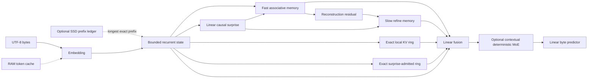
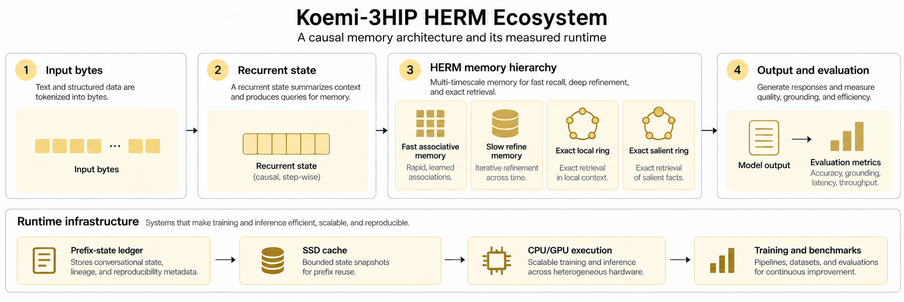
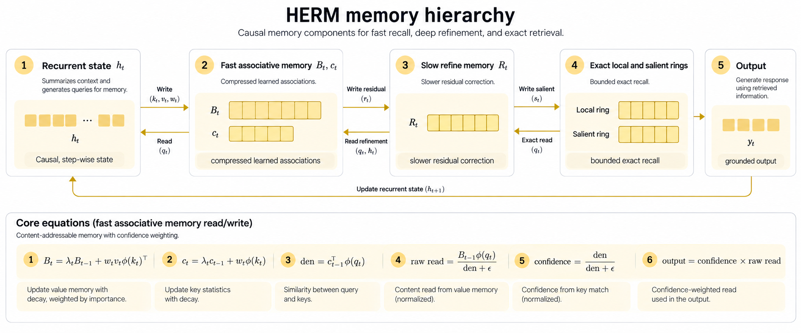
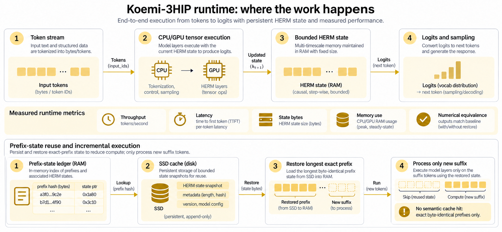
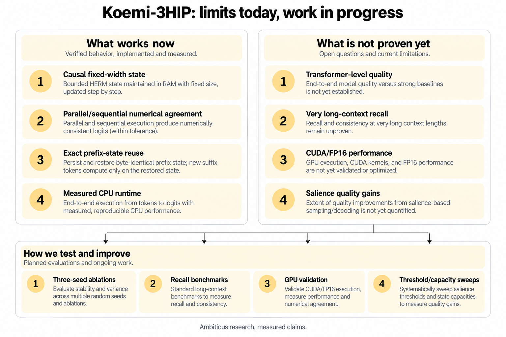
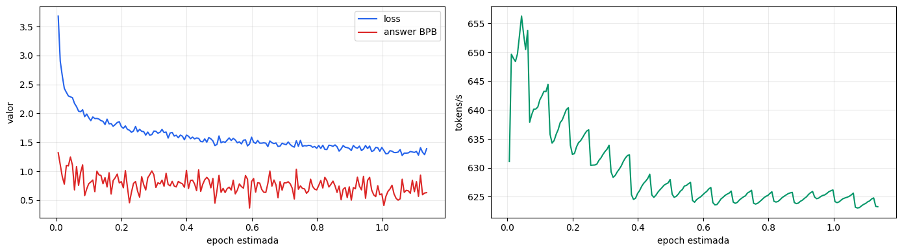

# Koemi-3HIP

Koemi-3HIP (Koemi-3 HERM Initial Phase) is a PyTorch training base for byte-level causal models built on
HERM (Hierarchical Error-Refined Memory): bounded recurrent state, rank-one
associative memory, exact recent and salient recall, and optional deterministic
experts. The slower refine tier is opt-in.

This repository contains architecture and training code. It does not ship a
trained model and does not claim Transformer-level quality.

## Problem

Large attention models spend memory and compute repeatedly processing context.
HERM keeps bounded associative state for the running sequence plus exact local
and surprise-admitted buffers. Prefix-state snapshots let a later request resume
from the longest byte-identical prefix instead of replaying it.

## Install

Requirements: Python 3.11 or newer and pip.

```bash
python -m venv .venv
.venv/bin/python -m pip install --upgrade pip
.venv/bin/python -m pip install -e .
```

On Windows, replace `.venv/bin/python` with `.venv\Scripts\python`.

## Dataset contract

The loader accepts UTF-8 `.txt`, `.json` arrays and `.jsonl` files. A normalized record uses
this shape:

```json
{
  "id": "queue-001",
  "system": "Answer in one sentence.",
  "input": "Explain FIFO in one sentence.",
  "thinking": "A queue preserves arrival order.",
  "output": "FIFO means first in, first out.",
  "metadata": {"source": "example"}
}
```

`thinking` is optional. Its bytes receive a separate target mask and can be
weighted with `--thinking-loss-weight`. The mask does not claim that visible
thinking text is an internal reasoning trace.

`system` is optional and is context, never a target. Its bytes precede the input
span and carry no supervision, so the model conditions on the instruction and is
never trained to reproduce it. A record without `system` serializes to exactly the
same bytes as before the field existed, which a test asserts, so datasets and
checkpoints from earlier runs stay valid. A ShareGPT `system` turn now maps to this
field instead of being rejected; several system turns join with a newline in the
order they appear, and a top-level `system` field applies only when the
conversation carries no system turn.

For plain text, set `output` to `null`; the complete `input` becomes the causal
training sequence. Alpaca and ShareGPT records enter through validated adapters.

```bash
.venv/bin/python -m koemi inspect-dataset --dataset examples/canonical.jsonl
```

## Train

The default model has no expert bank, which is the lowest-cost path. CUDA is
selected by the CLI when available; use `--device cpu` for deterministic local
verification.

```bash
.venv/bin/python -m koemi train \
  --dataset examples/canonical.jsonl \
  --checkpoint artifacts/koemi-3hip.pt \
  --overwrite \
  --expert-count 2 \
  --thinking-loss-weight 2.0
```

Training logs contain loss, thinking loss, surprise, valid-token count and
expert activations. Validation loss/perplexity, optimizer steps, learning rate,
precision and tokens/s are also reported. AdamW, warmup/cosine decay, gradient
accumulation, label smoothing and AMP are configured through CLI flags. Example
content is never logged.

## Generate

```bash
.venv/bin/python -m koemi generate \
  --checkpoint artifacts/koemi-3hip.pt \
  --system "Answer in one sentence." \
  --prompt "Explain FIFO." \
  --max-new-bytes 64 \
  --cache-capacity 256 \
  --mapping-cache D:\\koemi-cache \
  --mapping-cache-namespace local-session \
  --mapping-cache-ttl-seconds 3600
```

`--prompt` carries the user text alone. The command wraps it in the same role
markers the trainer wrote, so at inference the model sees the exact byte prefix it
saw during training. A test asserts that equality directly: the built prompt equals
the serialized record's bytes up to its first supervised position.

Only the continuation reaches stdout. The prefix the model was conditioned on is
stripped, and stripping fails loudly rather than silently when the generated text
does not start with it.

`--prompt-target thinking` ends the prefix at the thinking marker instead of the
output marker, for a checkpoint trained with thinking spans. `--raw-prompt` sends
`--prompt` verbatim and prints the whole text, which is what a checkpoint trained
on plain text needs; combining it with `--system` is refused.

The RAM cache reuses detached embeddings by token id. The optional mapping cache
also writes fixed-width state snapshots at scan boundaries and at the end of a
prompt. A later request restores the longest byte-identical prefix and processes
only its suffix. Entries use an explicit tenant/session plus checkpoint namespace,
expire under a sliding TTL and can be cleared only inside that namespace. This is
exact prefix reuse, not semantic similarity.

## Architecture



### Read the system in four diagrams

These figures are deliberately operational: each box names a component that
exists in this repository, and every claim is bounded by the tests and
measurements documented below.









### HERM memory choices

HERM uses four decisions inspired by the memory perspective in [MIRAS](https://research.google/blog/titans-miras-helping-ai-have-long-term-memory/):

- memory architecture: bounded vector state, fast and slow normalized
  associative matrices and a fixed local key-value ring;
- attentional bias: key/query feature similarity and local dot-product recall;
- retention gate: bounded decay with a learned write gate;
- memory algorithm: differentiable outer training plus two affine prefix scans.

The current implementation is a research base, not a reimplementation of
Titans. The Google overview identifies Titans as a concrete architecture and
MIRAS as the broader framework; Titans uses a deeper online-updated neural
memory than HERM does.

HERM is not a claim that recurrence has solved long-context intelligence. It is
an engineering hypothesis: keep the causal state width fixed, combine a learned
compressed memory with a few exact bounded slots, and measure the trade-off.

### One token, formally

At position `t`, the model performs the following causal sequence. No operation
uses the target byte that training will score at the next step.

1. Embed the byte and normalize it: `u_t = RMSNorm(Embedding(x_t))`.
2. Update the bounded recurrent state:

   ```text
   a_t = eps_a + (1 - 2 eps_a) sigmoid(W_a u_t + b_a)
   g_t = (1 - a_t) tanh(W_g u_t + b_g)
   h_t = a_t * h_(t-1) + g_t
   ```

   `a_t` is constrained to `(eps_a, 1-eps_a)`. The state therefore decays
   smoothly instead of exploding or being overwritten in one step.

3. Produce memory keys, values, features and a bounded write weight:

   ```text
   k_t = W_k h_t
   v_t = W_v h_t
   phi_t = softmax(W_phi k_t + b_phi)
   lambda_t = eps_d + (1 - 2 eps_d) sigmoid(W_d h_t + b_d)
   w_t = sigmoid(W_w h_t + b_w)
   ```

   Here `phi_t` is a positive feature distribution. The outer product
   `v_t phi_t^T` writes one rank-one association rather than a full new matrix.

4. Read the previous memory state before writing the current token:

   ```text
   q_t = W_q h_t
   psi_t = softmax(W_phi q_t + b_phi)
   den_t = c_(t-1)^T psi_t
   raw_t = B_(t-1) psi_t / (den_t + eps_m)
   confidence_t = den_t / (den_t + eps_m)
   m_t = confidence_t * raw_t
   ```

   The denominator is evidence that the query matches stored features. The
   confidence multiplier makes an empty memory say “no evidence” instead of
   turning division by `eps_m` into a 256x noise amplifier.

5. Update the fast memory and, when `--ablation herm` is selected, the slow
   residual memory:

   ```text
   B_t = lambda_t B_(t-1) + w_t v_t phi_t^T
   c_t = lambda_t c_(t-1) + w_t phi_t
   r_t = v_t - m_t
   ```

   The slow tier applies the same bounded scan to a residual with a slower
   decay. `no_refine` skips its compute by default; it does not pretend that a
   zero-cost tier has produced quality.

### Same equations, two audiences

In plain language, HERM keeps a small notebook (`h_t`), compresses repeated
patterns into a learned index (`B_t, c_t`), stores a slower correction (`R_t`),
and keeps a few exact recent or surprising details in bounded rings. In linear
algebra, it is a causal rank-one state-space update with normalized feature
contractions and no sequence-length-sized persistent state.

The parallel path evaluates a chunk using the closed form

```text
B_t = Lambda_t B_0 + sum_(s<=t) (Lambda_t/Lambda_s) w_s v_s phi_s^T
```

and computes all causal query/write interactions through a `[B,C,C]` matrix,
where `C` is the chunk length. It returns only reads and the final state. The
sequential path applies the recurrence token by token and remains the oracle.
`tests/model/test_associative_read.py` and `tests/model/test_execution.py`
compare both paths, including gradients.

### Exact detail and salience

The local ring retains the latest `W` projected key/value pairs. The salient
ring admits a token when `surprise_t > tau` and retains the latest `S` admitted
pairs, even when they are far outside the local window. Both reads are causal:
the query at `t` can see carried entries and current entries with index `< t`,
never a future token. `S=16` and `tau=0.75` are implementation defaults, not a
quality optimum; the required threshold/capacity sweep is still open.

### Training objective and reported numbers

For a supervised target byte `y_t`, the model minimizes causal cross-entropy:

```text
loss = - (1/N) sum_t log softmax(logits_t)[y_t]
bpb = loss / log(2)
perplexity = exp(loss)
```

Thinking bytes can receive a separate non-negative weight, but visible thinking
text is not treated as a hidden chain of thought. Every run reports supervised
token count, thinking-token count, loss, thinking loss, validation loss when
available, perplexity, learning rate, optimizer steps, precision and tokens/s.

### Hardware, RAM and SSD responsibilities

- CPU/GPU tensors execute the model. The CPU path is the currently measured path;
  CUDA and AMP are supported by configuration but require a CUDA host for proof.
- RAM holds active parameters and the fixed-width `KoemiState`. A state does not
  grow with conversation length.
- The RAM warm cache stores detached embeddings by token id. It is disabled in
  training because optimizer updates would make detached values stale.
- The opt-in SSD prefix ledger stores tensor-only snapshots at scan boundaries.
  A request finds the longest byte-identical prefix, restores its state and runs
  only the suffix. This is exact reuse, not semantic retrieval.
- Parameter offload has accelerator, host and disk tiers. Disk saves memory but
  adds I/O; it is not a speed optimization. Frozen parameters are required for
  the disk tier.

### What Koemi is — and is not

Koemi-3HIP is an ambitious research implementation with executable contracts,
not a Transformer replacement today. It currently provides a bounded causal
state, associative and exact memory paths, deterministic runtime behavior,
prefix reuse and reproducible CPU measurements. It does not yet establish
Transformer-level quality, arbitrary long-context recall, CUDA/FP16 speed, or a
quality gain from salience. Those are explicit experiments, not implied claims.

For positive features `phi`, the fast tier computes an epsilon-regularized read
and multiplies it by
`confidence = denominator / (denominator + epsilon)`. It updates with
`B_t = lambda_t B_(t-1) + w_t v_t phi(k_t)^T`. The slow tier receives the
bounded reconstruction residual `v_t - read_fast_t`, decays more slowly with
`lambda_s = 1 - (1 - lambda_t) rho`, and writes only in proportion to causal
surprise and local novelty when `--ablation herm` is selected. The parallel read
keeps the rank-one factors and contracts them through a causal `[B,C,C]` matrix;
it does not materialize `[B,L,d,m]` basis states.

### Surprise and chains

The previous recurrent state predicts the observed byte. Surprise is
`1 - exp(-NLL/log(256))`; it scales memory writes but never selects an execution
path. A carried `KoemiState` is the chain between generation steps; resetting it
starts a new session.

### Contextual deterministic MoE

When `--expert-count` is greater than zero, a mixing hash of the current byte and
the previous byte selects one expert. There is no risk head, top-k selector,
routing projection or routing loss. It is not learned semantic routing, but the
assignment is now a function of content alone, so an expert receives the same
bigrams every time it sees them.

Absolute position used to enter the hash, which made the dispatch a random
partition: the same bigram went to a different expert at every position, so no
expert could accumulate a coherent token set. Measured on 26,036 bytes of this
repository's prose, chi-square per degree of freedom was 1.10 at 64 experts, which
is indistinguishable from uniform random; a 64-expert run on real data reported
0.92. Dispatch on content alone gives 161.08, so the assignment now carries
information. No expert is left idle and every expert receives between 10 and 29
distinct bigrams. The busiest expert holds 3.3 times the uniform share; that skew
is the skew of byte-bigram frequency, and it costs nothing because every token
still passes through exactly one expert.

The hash mixes its bits instead of combining terms linearly. The previous form was
affine, so `remainder(expert_count)` saw only the low bits: with consecutive bytes,
where the previous byte is one less than the current one, it reached 1 expert of 4
and 16 of 64. The mixing form reaches 4 of 4 and 63 of 64.

## Parameter offload

Offload moves parameters off the compute device by how much arithmetic their
residency actually buys. The ranking is measured, not declared: one calibration
forward records how many token-rows reach each module, `FLOPs / parameter byte`
follows from the module type and those rows, and the budget is filled from the
top down.

That metric puts the parts in the order you would expect and for a stated reason.
The byte predictor is reached twice per forward, once for the logits and once for
the surprise preview, so it ranks first. The memory and fusion projections see
every token, so they come next. An expert sees only the tokens its dispatch sent
it, so a wider bank ranks lower per expert. The embedding table performs a gather
and no arithmetic at all, so it ranks last: keeping it resident buys no compute.

Three tiers, in fill order:

| Tier | Where the parameter lives | Trainable | Cost per forward |
| --- | --- | --- | --- |
| `accelerator` | compute device | yes | none |
| `host` | host memory, copied per forward | yes | one host-to-device copy |
| `disk` | storage, read per forward | no, must be frozen | one file read |

```bash
.venv/bin/python -m koemi train \
  --dataset examples/canonical.jsonl \
  --checkpoint artifacts/koemi.pt \
  --offload-accelerator-mib 512 \
  --offload-host-mib 2048 \
  --overwrite

.venv/bin/python -m koemi generate \
  --checkpoint artifacts/koemi.pt \
  --prompt "FIFO means" \
  --offload-accelerator-mib 0 \
  --offload-host-mib 0 \
  --offload-store artifacts/offload-weights
```

The host tier keeps the parameter as the autograd leaf. A hook running immediately
before the module's forward lends it a copy on the compute device and takes the
copy back afterwards, so the gradient lands on the host leaf and the optimizer
needs no change. Logits and gradients are bit-exact against a fully resident
model, and a test asserts it with `torch.equal`. On a host with no accelerator the
copy is the identity, so the mechanism runs but the transfer it exists for cannot
be measured here.

The disk tier refuses a parameter that still requires a gradient, with the module
and parameter named in the error. That restriction is the honest one: a weight the
optimizer updates cannot be thrown away after every forward. It also describes the
case it is built for, a finetune over a frozen base, and inference.

Disk offload buys memory with time, and the log says how much.
`--offload-residency-mib` puts a bounded read cache in front of the store, evicting
by least recent use, and turns the repeated reads into one read per parameter.

Generating 24 bytes from a 111,024-byte model with every module on the disk tier:

| Residency budget | Store reads | Bytes read | Seconds in reads | Cache hits |
| ---: | ---: | ---: | ---: | ---: |
| 0 MiB | 925 | 3,778,900 | 2.1926 | 0 |
| 1 MiB | 921 | 110,896 | 0.2017 | 892 |

Without the cache the run read 34 times the parameter footprint. With 1 MiB it read
each parameter once: 34.1 times fewer bytes and 10.9 times less time inside reads.
The cache lives in host memory, so the budget is the memory you are trading back
for speed; leave it at zero when the point is to hold nothing resident.

Use the disk tier when the model does not fit, not to make it faster.

Every run logs `offload_plan` with the bytes and module count per tier and the
materialization counters, so a plan can be checked against the machine it ran on.

## Configuration

| Option | Default | Effect |
| --- | ---: | --- |
| `--embedding-size` | `64` | Width of token embeddings and recurrent state. |
| `--memory-features` | `16` | Width of associative memory features. |
| `--local-memory-size` | `16` | Number of exact local key-value slots. |
| `--salience-memory-size` | `16` | Number of exact surprise-admitted slots. |
| `--salience-threshold` | `0.75` | Causal surprise required for salient admission. |
| `--expert-count` | `0` | Context-hash expert count; zero disables MoE. |
| `--cache-capacity` | `256` | Maximum RAM token embeddings. |
| `--scan-chunk` | `128` | Sequence bucket used by the parallel path. |
| `--refine-decay-rate` | `0.0625` | Slow-memory timescale relative to fast decay. |
| `--offload-accelerator-mib` | unlimited | Parameter budget kept on the compute device. |
| `--offload-host-mib` | unlimited | Parameter budget streamed from host memory. |
| `--offload-store` | none | Directory for parameters evicted to storage. |
| `--offload-residency-mib` | `0` | Read cache in front of the offload store. |
| `--system` | none | System text placed before the user text at inference. |
| `--prompt-target` | `answer` | `answer` or `thinking`: which span the model continues. |
| `--raw-prompt` | off | Send `--prompt` verbatim, without the role markers. |
| `--thinking-loss-weight` | `1.0` | Relative weight of supervised thinking bytes. |
| `--gradient-accumulation-steps` | `1` | Microbatches per optimizer update. |
| `--precision` | `auto` | FP32 on CPU; BF16 or FP16 AMP on supported CUDA. |
| `--validation-fraction` | `0.0` | Deterministic record-level holdout fraction. |
| `--num-workers` | `0` | DataLoader worker processes. |
| `--ablation` | `no_refine` | Fast tier by default; `herm` enables refine, with `no_surprise` and `affine` controls. |
| `--device` | CUDA if available | PyTorch device used for training or generation. |
| `--execution-mode` | `parallel` | `parallel` scan or sequential correctness path. |

## Benchmark

The ready-to-run English analysis notebook is
[`notebooks/Koemi-3HIP_Analysis.ipynb`](notebooks/Koemi-3HIP_Analysis.ipynb). It
contains the bounded causal evaluator, explicit answer/thinking denominators,
moving-median curves and a monochrome pastel-yellow report style. Point
`RUN_LOG` at a JSONL training log after a run; missing series are reported as
missing rather than fabricated.

```bash
.venv/bin/python benchmarks/run_benchmark.py --task bytes --report artifacts/bench-bytes-koemi-3hip.json
.venv/bin/python benchmarks/run_benchmark.py --task recall --report artifacts/bench-recall-koemi-3hip.json
.venv/bin/python benchmarks/run_ablation.py --task recall --seeds 17 29 41 --train-records 1024 --evaluation-records 1024 --epochs 4 --report artifacts/ablation-recall.json
```

The harness compares Koemi-3HIP with parameter-matched GRU and LSTM baselines. The
old Koemi-1FPA measurements remain archived in [`docs/BENCHMARK.md`](docs/BENCHMARK.md)
and are not Koemi-3HIP results. The ablation runner requires at least three seeds and
reports mean and standard deviation. The affine control is the minimum quality
baseline; a small-budget single-seed run is not evidence of memory capacity.

### Legacy training, before Koemi became HIP

The following plot belongs to the pre-HIP training line. It is preserved as a
historical record, not presented as current Koemi-3HIP evidence:



The old run shows loss decreasing while answer BPB remains noisy and throughput
oscillates during training. It is useful for understanding where the project
came from; it does not measure the current prefix ledger, rank-one chunk read,
confidence gate or salient ring.

## Known limitations

- Checkpoint format 7 adds the salient fusion input. Formats 5 and 6 are refused
  because their expert partition or fusion weights describe a different model.
- Contextual deterministic experts are not learned semantic routing. Learned
  expert selection would reintroduce a router, contrary to this architecture.
- The role markers are reserved. A dataset span or an inference prompt carrying
  `<|system|>`, `<|input|>`, `<|thinking|>` or `<|output|>` is refused at the
  boundary, naming the field and the tag, because a byte vocabulary of 256 content
  ids plus one padding id has no room for dedicated control tokens and forged text
  would otherwise move a span boundary. `--raw-prompt` bypasses the check for a
  checkpoint that was never trained with markers.
- The offload store writes parameter files outside the checkpoint. Point
  `--offload-store` at a private directory: the files are plain weights and no
  namespace or expiry protects them.
- The disk cache reuses byte-identical prefixes only; a similar question needs
  retrieval and a similarity contract outside this phase.
- Disk entries contain recurrent state and final logits and can encode prompt
  content.
  The cache is opt-in, requires an explicit namespace and provides TTL,
  namespace-local deletion and size/capacity limits. Payload encryption is not
  provided.
- SSD storage avoids recomputing an exact cached sequence but cannot replace
  GPU or RAM for arbitrary active computation; I/O latency can dominate on an
  HDD.
- There is no `asyncio` cognition scheduler or arbitrary layer offload. HERM's
  concurrency is tensor-level parallelism inside the causal scan window.
- The associative tier and optional refine tier may still lose multi-key
  interactions. MQAR and long-context recall are still required.
- UTF-8 byte tokenization uses more positions than a learned tokenizer.
- No Triton kernel, distributed training, semantic retrieval, persistent
  episodic memory or tool use exists.

## Project layout

```text
src/koemi/
  configuration/  Model and training settings
  data/           JSON validation, adapters, serialization and tokenizer
  model/          HERM state, memory, cache, scan and deterministic MoE
  runtime/        parameter offload: traffic calibration, tiers, disk store
  training/       Causal chunks, objective, trainer, checkpoint and generation
benchmarks/       Koemi-3HIP against parameter-matched GRU and LSTM baselines
tests/            Data, model, cache, execution and training contracts
examples/         Valid JSON and JSONL inputs
```

## Test

```bash
.venv/bin/python -m unittest discover -s tests -v
```

## License

This project is licensed under the MIT License. See [LICENSE](LICENSE).
