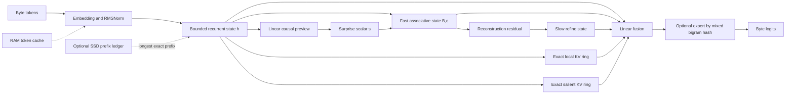

# Koemi-3HIP architecture

Koemi-3HIP (Koemi-3 HERM Initial Phase) is the current research architecture for training causal models in
the Koemi infrastructure. Its state family is HERM (Hierarchical Error-Refined
Memory). HERM is an architecture and runtime mechanism; it is not a trained
model by itself.

## Design target

HERM combines the linear state update of recurrent sequence models with a small
exact retrieval window and fast/slow trainable associative memories. The model trains
with PyTorch, uses CUDA when requested or available, and retains a sequential
path as a numerical oracle for the parallel path.

The project takes its memory vocabulary from [Titans + MIRAS](https://research.google/blog/titans-miras-helping-ai-have-long-term-memory/).
MIRAS separates memory architecture, attentional bias, retention gate and
memory algorithm. Titans is a concrete architecture that uses an online-updated
neural memory. Koemi-3HIP currently uses a bounded associative state and does
not claim to reproduce Titans.

## Non-goals

- Transformer parity without a measured benchmark.
- Learned token routing or adaptive deep paths.
- Persistent prompt memory by default.
- Arbitrary semantic reuse from a cache without a retrieval index.
- Disk-backed execution of arbitrary layers.

## Architecture map



## Mathematical specification

Let `x_t` be the byte embedding at position `t`, `u_t = RMSNorm(x_t)`, and
`d` the model width.

### 1. Bounded recurrent state

The retention and candidate projections depend only on the current normalized
token:

```text
a_t = eps_a + (1 - 2 eps_a) sigmoid(W_a u_t + b_a)
g_t = (1 - a_t) tanh(W_g u_t + b_g)
h_t = a_t * h_(t-1) + g_t
```

`eps_a = 2^-8`, so every state update is finite and bounded by the input
increments. Since `(a_t, g_t)` is token-local, the recurrence has an affine
prefix scan. The eager sequential loop remains the reference implementation.

### 2. Associative semantic memory

HERM stores fast and slow matrices `B_t, R_t in R^(d x r)` and normalizers
`c_t, z_t in R^r`, where `r`
is `memory_features`:

```text
k_t = W_k h_t
v_t = W_v h_t
phi_t = softmax(W_phi k_t + b_phi)
d_t = eps_d + (1 - 2 eps_d) sigmoid(W_d h_t + b_d)
w_t = sigmoid(W_w h_t + b_w)
B_t = d_t * B_(t-1) + w_t * v_t outer phi_t
c_t = d_t * c_(t-1) + w_t * phi_t
```

The read uses the previous state, which keeps the update causal:

```text
q_t = W_q h_t
psi_t = softmax(W_phi q_t + b_phi)
den_t = c_(t-1) dot psi_t
raw_t = B_(t-1) psi_t / (den_t + eps_m)
confidence_t = den_t / (den_t + eps_m)
m_t = confidence_t * raw_t
```

The confidence gate makes zero evidence produce zero even if a loaded or corrupt
basis is inconsistent with its normalizer. The denominator is scalar after
feature contraction, avoiding a full covariance or matrix inverse. The slow tier writes a bounded residual
`r_t = v_t - m_t` with longer retention and a surprise/novelty weight. Both
tiers are affine scans.

The parallel evaluator keeps each update as `(w_t, v_t, phi_t)` and computes
within-chunk write/query influence through a causal `[B,C,C]` contraction. It
returns the reads and final matrix only. The old `[B,L,d,m]` sequence of basis
increments and states is absent from the runtime path.

### 3. Surprise-controlled writing

The model obtains a cheap prediction signal before reading semantic memory:

```text
s_t = 1 - exp(-NLL(byte_t | h_(t-1)) / log(256))
w'_t = w_t * (0.25 + 0.75 s_t)
```

`w'_t` is used in the associative write. This gives surprising tokens more
write influence while still allowing the learned write gate to suppress noise.
The target byte is not available to the forward pass, so the training target
cannot leak into `s_t`. Surprise does not select an execution branch.

### 4. Exact local retrieval

The local state contains at most `W` key/value pairs and a validity mask. At
position `t`, only pairs from positions before `t` are visible:

```text
alpha_t = softmax(K_(t-1) q_t / sqrt(d))
l_t = sum_j alpha_(t,j) V_(t-1,j)
```

The oldest pair is discarded after the current token is processed. Cost is
`O(Wd)` per token and state storage is bounded by `O(Wd)`. Padding entries are
never considered valid pairs.

### 5. Exact salient retrieval

A second bounded ring uses the same projected key/value entries. Admission is
causal and independent for each token:

```text
keep_t = valid_t and surprise_t > tau
```

The ring retains the last `S` admitted entries at any distance. A parallel query
sees carried entries and admitted positions strictly before itself; future
admissions cannot change an earlier output. `S=16` and `tau=0.75` are experiment
defaults, not demonstrated quality optima.

### 6. Fusion and fixed-dispatch MoE

The four states are concatenated into one typed context:

```text
z_t = RMSNorm(W_z [h_t || m_t || l_t || a_t] + b_z)
```

When `expert_count = E > 0`, dispatch is fixed and deterministic:

```text
e_t = mix_hash(token_id_t, token_id_(t-1)) mod E
y_t = RMSNorm(z_t + FFN_e_t(z_t))
```

Exactly one expert processes each valid token. There is no routing projection,
risk head, top-k selector, soft mixture or routing loss. This is a deliberate
trade-off: Koemi-3HIP has a predictable sparse expert bank, not learned semantic MoE
dispatch. `expert_count = 0` skips the bank entirely.

Absolute position is excluded so a repeated bigram has a stable expert. The
mixing finalizer prevents power-of-two expert counts from reading only the low
bits of an affine byte combination.

### 7. Causal prediction

```text
logits_t = W_vocab y_t + b_vocab
p_t = softmax(logits_t)
```

The outer loss is causal cross entropy over supervised target positions.

## Thinking training

The canonical record may contain `thinking`. Serialization emits the input,
thinking span and output span in order. The dataset propagates two masks:

- `supervised_mask`: positions contributing to causal loss;
- `thinking_mask`: supervised positions belonging to the thinking span.

The objective reports ordinary task loss and thinking loss separately. A
`thinking_loss_weight` of `1.0` leaves the ordinary average unchanged. Other
non-negative values change the contribution of thinking positions. This makes
thinking and fixed-dispatch MoE composable without representing visible traces
as a hidden cognition claim.

## Cache tiers and chains

Koemi-3HIP has explicit cache tiers:

| Tier | Location | Content | Reuse rule |
| --- | --- | --- | --- |
| L0 | GPU/CPU tensors | carried `KoemiState` | caller passes state within one session |
| L1 | RAM or device memory | detached token embeddings | token id and matching device/dtype |
| L2 | opt-in SSD directory | final logits and bounded state | longest byte-identical prefix |

The L1 `WarmTokenCache` avoids repeated embedding lookups. It is disabled during
training because detached embeddings would become stale after optimizer steps.

The L2 `DiskMappingCache` stores tensor-only prefix snapshots with a format
version, checkpoint namespace, rolling BLAKE2 filename, bounded entry count,
weights-only loading and atomic writes. Prompt evaluation resumes from the
longest hit and computes only the suffix. It does not infer
that a semantically similar question has the same answer. That requires a
retrieval index and a validation policy.

Disk entries can encode prompt information through recurrent state and logits.
The cache is therefore opt-in; it requires a caller namespace, sliding TTL and
namespace-local deletion/clear. Production authorization and payload encryption
remain outside this package.

SSD is a storage tier, not a faster arithmetic unit. Paging active layers to an
HDD or SSD on every token can be slower than keeping them in RAM or VRAM. HERM
only uses disk for exact mappings whose read can replace a complete computation.

## Execution and training

The parallel path partitions long sequences into `scan_chunk` windows. Inside a
window it uses an affine scan for recurrent state and a causal dense contraction
for associative reads and the final state. The sequential path performs the same
equations one token at a time. Tests compare
logits, state tensors and selected gradients before any GPU kernel optimization.

This is tensor-level parallelism, not an `asyncio` scheduler. Causal state
dependencies still serialize the chain boundary, while independent positions
inside a scan window are exposed to PyTorch and the GPU. Arbitrary per-layer
async scheduling or paging active layers to disk is intentionally not used as a
performance claim.

Training defaults to CUDA when available in the CLI and falls back to CPU. The
model does not allocate a second deep path, so removing routing reduces
parameters and intermediate tensors directly. Actual speed and VRAM changes
must be measured by the Koemi-3HIP benchmark.

## Implementation status

| Contract | Implementation | Status |
| --- | --- | --- |
| Bounded recurrent state | `model/memory.py` | implemented |
| Affine parallel scan | `model/scan.py` | implemented and compared |
| Hierarchical fast/slow associative memory | `model/memory.py` | implemented |
| Surprise write scaling | `model/network.py` | implemented |
| Exact local and salient rings with validity | `model/memory.py` | implemented |
| Fixed-dispatch MoE | `model/experts.py` | implemented |
| Thinking mask and weighted loss | `training/dataset.py`, `training/objective.py` | implemented |
| RAM warm embedding cache | `model/cache.py` | implemented |
| Optional SSD exact prefix ledger | `model/cache.py`, `training/generation.py` | implemented |
| Semantic episodic memory | none | out of scope |
| Learned semantic retrieval | none | out of scope |
| Distributed/GPU kernel path | none | pending |

## Required gates before architecture claims

- MQAR, copy and needle recall at a budget where at least one baseline solves
  the task;
- Koemi-3HIP versus GRU, LSTM, Mamba-2, Gated DeltaNet and a Transformer at matched
  tokenizer, parameter count, token budget, precision and device;
- p50/p95 training and decode throughput, peak VRAM/RAM and state bytes;
- ablations for `expert_count`, local window, memory feature width and cache
  hit rate;
- cache invalidation, corruption, retention and cross-session isolation tests;
- NaN/Inf, state norm, surprise distribution and write-rate reports.

Until those gates run, Koemi-3HIP is a research hypothesis with executable contracts,
not evidence that Koemi models are comparable to a production AI system.
